Working with Tidyverse
================

install.packages(c(“tidyverse”, “babynames”, “fivethirtyeight”,
“gapminder”, “nycflights13”, “rmarkdown”, “skimr”))

# Tidy data

Data comes in many formats but R prefers just one: *tidy data*.

A data set is tidy if and only if:

1.  Every variable is in its own column
2.  Every observation is in its own row
3.  Every value is in its own cell

## We begin with a toy dataset

``` r
cases <- tribble(
  ~Country, ~"2011", ~"2012", ~"2013",
      "FR",    7000,    6900,    7000,
      "DE",    5800,    6000,    6200,
      "US",   15000,   14000,   13000
)

pollution <- tribble(
       ~city,   ~size, ~amount,
  "New York", "large",      23,
  "New York", "small",      14,
    "London", "large",      22,
    "London", "small",      16,
   "Beijing", "large",     121,
   "Beijing", "small",     56
)
```

## Tidy and untidy data

`table1` is tidy:

``` r
table1 
```

    ## # A tibble: 6 x 4
    ##   country      year  cases population
    ##   <chr>       <int>  <int>      <int>
    ## 1 Afghanistan  1999    745   19987071
    ## 2 Afghanistan  2000   2666   20595360
    ## 3 Brazil       1999  37737  172006362
    ## 4 Brazil       2000  80488  174504898
    ## 5 China        1999 212258 1272915272
    ## 6 China        2000 213766 1280428583

For example, it’s easy to add a rate column with `mutate()`:

``` r
table1 %>%
  mutate(rate = cases/population)
```

    ## # A tibble: 6 x 5
    ##   country      year  cases population      rate
    ##   <chr>       <int>  <int>      <int>     <dbl>
    ## 1 Afghanistan  1999    745   19987071 0.0000373
    ## 2 Afghanistan  2000   2666   20595360 0.000129 
    ## 3 Brazil       1999  37737  172006362 0.000219 
    ## 4 Brazil       2000  80488  174504898 0.000461 
    ## 5 China        1999 212258 1272915272 0.000167 
    ## 6 China        2000 213766 1280428583 0.000167

`table2` isn’t tidy, the count column really contains two variables:

``` r
table2
```

    ## # A tibble: 12 x 4
    ##    country      year type            count
    ##    <chr>       <int> <chr>           <int>
    ##  1 Afghanistan  1999 cases             745
    ##  2 Afghanistan  1999 population   19987071
    ##  3 Afghanistan  2000 cases            2666
    ##  4 Afghanistan  2000 population   20595360
    ##  5 Brazil       1999 cases           37737
    ##  6 Brazil       1999 population  172006362
    ##  7 Brazil       2000 cases           80488
    ##  8 Brazil       2000 population  174504898
    ##  9 China        1999 cases          212258
    ## 10 China        1999 population 1272915272
    ## 11 China        2000 cases          213766
    ## 12 China        2000 population 1280428583

It makes it very hard to manipulate.

## Your Turn 1

On a sheet of paper, draw how the cases data set would look if it had
the same values grouped into three columns: **country**, **year**, **n**

|   country   | year | cases  |
| :---------: | :--: | :----: |
| Afghanistan | 1999 |  745   |
| Afghanistan | 2000 |  2666  |
|   Brazil    | 1999 | 37737  |
|   Brazil    | 2000 | 80488  |
|    China    | 1999 | 212258 |
|    China    | 2000 | 213766 |

## Tidy verbs include:

`pivot_longer()` to make data longer `pivot_wider()` to make data wider
`separate()` to split a column `separate_rows()` to separate rows
`unite()` to unite columns

## Your Turn 2

Use `pivot_longer()` to reorganize `table4a` into three columns:
**country**, **year**, and **cases**.

``` r
table4a %>%
 pivot_longer(-country, names_to = "year", 
    values_to = "cases") 
```

    ## # A tibble: 6 x 3
    ##   country     year   cases
    ##   <chr>       <chr>  <int>
    ## 1 Afghanistan 1999     745
    ## 2 Afghanistan 2000    2666
    ## 3 Brazil      1999   37737
    ## 4 Brazil      2000   80488
    ## 5 China       1999  212258
    ## 6 China       2000  213766

## Your Turn 3

On a sheet of paper, draw how this data set would look if it had the
same values grouped into three columns: **city**, **large**, **small**

|   city   | large | small |
| :------: | :---: | :---: |
| Beijing  |  121  |  121  |
|  London  |  22   |  16   |
| New York |  23   |  14   |

## Your Turn 4

Use `pivot_wider()` to reorganize `table2` into four columns:
**country**, **year**, **cases**, and **population**.

``` r
table2 %>%
  pivot_wider(names_from = type, values_from = count)
```

    ## # A tibble: 6 x 4
    ##   country      year  cases population
    ##   <chr>       <int>  <int>      <int>
    ## 1 Afghanistan  1999    745   19987071
    ## 2 Afghanistan  2000   2666   20595360
    ## 3 Brazil       1999  37737  172006362
    ## 4 Brazil       2000  80488  174504898
    ## 5 China        1999 212258 1272915272
    ## 6 China        2000 213766 1280428583

# Transforming data with dplyr

Dplyr gives you three *general* functions for manipulating data:
`mutate()`, `summarise()`, and `group_by()`. These may be augmented
these with functions from the packages below, which focus on specific
types of data.

| Package   | Data Type       |
| --------- | --------------- |
| forcats   | factors         |
| stringr   | strings         |
| hms       | times           |
| lubridate | dates and times |

# Babynames

``` r
babynames
```

    ## # A tibble: 1,924,665 x 5
    ##     year sex   name          n   prop
    ##    <dbl> <chr> <chr>     <int>  <dbl>
    ##  1  1880 F     Mary       7065 0.0724
    ##  2  1880 F     Anna       2604 0.0267
    ##  3  1880 F     Emma       2003 0.0205
    ##  4  1880 F     Elizabeth  1939 0.0199
    ##  5  1880 F     Minnie     1746 0.0179
    ##  6  1880 F     Margaret   1578 0.0162
    ##  7  1880 F     Ida        1472 0.0151
    ##  8  1880 F     Alice      1414 0.0145
    ##  9  1880 F     Bertha     1320 0.0135
    ## 10  1880 F     Sarah      1288 0.0132
    ## # … with 1,924,655 more rows

``` r
print(babynames) 
```

    ## # A tibble: 1,924,665 x 5
    ##     year sex   name          n   prop
    ##    <dbl> <chr> <chr>     <int>  <dbl>
    ##  1  1880 F     Mary       7065 0.0724
    ##  2  1880 F     Anna       2604 0.0267
    ##  3  1880 F     Emma       2003 0.0205
    ##  4  1880 F     Elizabeth  1939 0.0199
    ##  5  1880 F     Minnie     1746 0.0179
    ##  6  1880 F     Margaret   1578 0.0162
    ##  7  1880 F     Ida        1472 0.0151
    ##  8  1880 F     Alice      1414 0.0145
    ##  9  1880 F     Bertha     1320 0.0135
    ## 10  1880 F     Sarah      1288 0.0132
    ## # … with 1,924,655 more rows

## Using skimr to view the data

``` r
skim(babynames)
```

|                                                  |           |
| :----------------------------------------------- | :-------- |
| Name                                             | babynames |
| Number of rows                                   | 1924665   |
| Number of columns                                | 5         |
| \_\_\_\_\_\_\_\_\_\_\_\_\_\_\_\_\_\_\_\_\_\_\_   |           |
| Column type frequency:                           |           |
| character                                        | 2         |
| numeric                                          | 3         |
| \_\_\_\_\_\_\_\_\_\_\_\_\_\_\_\_\_\_\_\_\_\_\_\_ |           |
| Group variables                                  | None      |

Data summary

**Variable type:
character**

| skim\_variable | n\_missing | complete\_rate | min | max | empty | n\_unique | whitespace |
| :------------- | ---------: | -------------: | --: | --: | ----: | --------: | ---------: |
| sex            |          0 |              1 |   1 |   1 |     0 |         2 |          0 |
| name           |          0 |              1 |   2 |  15 |     0 |     97310 |          0 |

**Variable type:
numeric**

| skim\_variable | n\_missing | complete\_rate |    mean |      sd |   p0 |  p25 |  p50 |  p75 |     p100 | hist  |
| :------------- | ---------: | -------------: | ------: | ------: | ---: | ---: | ---: | ---: | -------: | :---- |
| year           |          0 |              1 | 1974.85 |   34.03 | 1880 | 1951 | 1985 | 2003 |  2017.00 | ▁▂▃▅▇ |
| n              |          0 |              1 |  180.87 | 1533.34 |    5 |    7 |   12 |   32 | 99686.00 | ▇▁▁▁▁ |
| prop           |          0 |              1 |    0.00 |    0.00 |    0 |    0 |    0 |    0 |     0.08 | ▇▁▁▁▁ |

``` r
my_skim <- skim_with(numeric = sfl(p25 = NULL, p75=NULL))
my_skim(babynames)
```

|                                                  |           |
| :----------------------------------------------- | :-------- |
| Name                                             | babynames |
| Number of rows                                   | 1924665   |
| Number of columns                                | 5         |
| \_\_\_\_\_\_\_\_\_\_\_\_\_\_\_\_\_\_\_\_\_\_\_   |           |
| Column type frequency:                           |           |
| character                                        | 2         |
| numeric                                          | 3         |
| \_\_\_\_\_\_\_\_\_\_\_\_\_\_\_\_\_\_\_\_\_\_\_\_ |           |
| Group variables                                  | None      |

Data summary

**Variable type:
character**

| skim\_variable | n\_missing | complete\_rate | min | max | empty | n\_unique | whitespace |
| :------------- | ---------: | -------------: | --: | --: | ----: | --------: | ---------: |
| sex            |          0 |              1 |   1 |   1 |     0 |         2 |          0 |
| name           |          0 |              1 |   2 |  15 |     0 |     97310 |          0 |

**Variable type:
numeric**

| skim\_variable | n\_missing | complete\_rate |    mean |      sd |   p0 |  p50 |     p100 | hist  |
| :------------- | ---------: | -------------: | ------: | ------: | ---: | ---: | -------: | :---- |
| year           |          0 |              1 | 1974.85 |   34.03 | 1880 | 1985 |  2017.00 | ▁▂▃▅▇ |
| n              |          0 |              1 |  180.87 | 1533.34 |    5 |   12 | 99686.00 | ▇▁▁▁▁ |
| prop           |          0 |              1 |    0.00 |    0.00 |    0 |    0 |     0.08 | ▇▁▁▁▁ |

## On your own

Run the skim\_with() command, and then try skimming `babynames` again to
see how the output is different. Look at the examples and try some other
variations.

skim\_with() is a closure: a function that returns a new function. This
lets you have several skimming functions in a single R session, but it
also means that you need to assign the return of skim\_with() before you
can use it.

# Mastering dplyr verbs

## Select

``` r
select(babynames, name, prop)
```

    ## # A tibble: 1,924,665 x 2
    ##    name        prop
    ##    <chr>      <dbl>
    ##  1 Mary      0.0724
    ##  2 Anna      0.0267
    ##  3 Emma      0.0205
    ##  4 Elizabeth 0.0199
    ##  5 Minnie    0.0179
    ##  6 Margaret  0.0162
    ##  7 Ida       0.0151
    ##  8 Alice     0.0145
    ##  9 Bertha    0.0135
    ## 10 Sarah     0.0132
    ## # … with 1,924,655 more rows

## Your Turn 5

Alter the code to select just the `n` column:

``` r
select(babynames, n)
```

    ## # A tibble: 1,924,665 x 1
    ##        n
    ##    <int>
    ##  1  7065
    ##  2  2604
    ##  3  2003
    ##  4  1939
    ##  5  1746
    ##  6  1578
    ##  7  1472
    ##  8  1414
    ##  9  1320
    ## 10  1288
    ## # … with 1,924,655 more rows

## Consider

Which of these is NOT a way to select the `name` and `n` columns
together?

``` r
select(babynames, -c(year, sex, prop))
```

    ## # A tibble: 1,924,665 x 2
    ##    name          n
    ##    <chr>     <int>
    ##  1 Mary       7065
    ##  2 Anna       2604
    ##  3 Emma       2003
    ##  4 Elizabeth  1939
    ##  5 Minnie     1746
    ##  6 Margaret   1578
    ##  7 Ida        1472
    ##  8 Alice      1414
    ##  9 Bertha     1320
    ## 10 Sarah      1288
    ## # … with 1,924,655 more rows

``` r
select(babynames, name:n)
```

    ## # A tibble: 1,924,665 x 2
    ##    name          n
    ##    <chr>     <int>
    ##  1 Mary       7065
    ##  2 Anna       2604
    ##  3 Emma       2003
    ##  4 Elizabeth  1939
    ##  5 Minnie     1746
    ##  6 Margaret   1578
    ##  7 Ida        1472
    ##  8 Alice      1414
    ##  9 Bertha     1320
    ## 10 Sarah      1288
    ## # … with 1,924,655 more rows

``` r
select(babynames, starts_with("n"))
```

    ## # A tibble: 1,924,665 x 2
    ##    name          n
    ##    <chr>     <int>
    ##  1 Mary       7065
    ##  2 Anna       2604
    ##  3 Emma       2003
    ##  4 Elizabeth  1939
    ##  5 Minnie     1746
    ##  6 Margaret   1578
    ##  7 Ida        1472
    ##  8 Alice      1414
    ##  9 Bertha     1320
    ## 10 Sarah      1288
    ## # … with 1,924,655 more rows

``` r
select(babynames, ends_with("n"))
```

    ## # A tibble: 1,924,665 x 1
    ##        n
    ##    <int>
    ##  1  7065
    ##  2  2604
    ##  3  2003
    ##  4  1939
    ##  5  1746
    ##  6  1578
    ##  7  1472
    ##  8  1414
    ##  9  1320
    ## 10  1288
    ## # … with 1,924,655 more rows

## Filter

``` r
filter(babynames, name == "Amelia")
```

    ## # A tibble: 169 x 5
    ##     year sex   name       n    prop
    ##    <dbl> <chr> <chr>  <int>   <dbl>
    ##  1  1880 F     Amelia   221 0.00226
    ##  2  1881 F     Amelia   235 0.00238
    ##  3  1882 F     Amelia   252 0.00218
    ##  4  1883 F     Amelia   262 0.00218
    ##  5  1884 F     Amelia   315 0.00229
    ##  6  1885 F     Amelia   298 0.00210
    ##  7  1886 F     Amelia   326 0.00212
    ##  8  1887 F     Amelia   344 0.00221
    ##  9  1888 F     Amelia   358 0.00189
    ## 10  1889 F     Amelia   346 0.00183
    ## # … with 159 more rows

## Your Turn 6

Show:

  - All of the names where prop is greater than or equal to 0.08  
  - All of the children named “Sea”  
  - All of the names that have a missing value for `n`

<!-- end list -->

``` r
filter(babynames, prop >= 0.08)
```

    ## # A tibble: 3 x 5
    ##    year sex   name        n   prop
    ##   <dbl> <chr> <chr>   <int>  <dbl>
    ## 1  1880 M     John     9655 0.0815
    ## 2  1880 M     William  9532 0.0805
    ## 3  1881 M     John     8769 0.0810

``` r
filter(babynames, name == "Sea")
```

    ## # A tibble: 4 x 5
    ##    year sex   name      n       prop
    ##   <dbl> <chr> <chr> <int>      <dbl>
    ## 1  1982 F     Sea       5 0.00000276
    ## 2  1985 M     Sea       6 0.00000312
    ## 3  1986 M     Sea       5 0.0000026 
    ## 4  1998 F     Sea       5 0.00000258

``` r
filter(babynames, is.na(n))
```

    ## # A tibble: 0 x 5
    ## # … with 5 variables: year <dbl>, sex <chr>, name <chr>, n <int>, prop <dbl>

## Your Turn 7

Use Boolean operators to alter the code below to return only the rows
that contain:

  - Girls named Sea  
  - Names that were used by exactly 5 or 6 children in 1880  
  - Names that are one of Acura, Lexus, or Yugo

<!-- end list -->

``` r
filter(babynames, name == "Sea", sex == "F")
```

    ## # A tibble: 2 x 5
    ##    year sex   name      n       prop
    ##   <dbl> <chr> <chr> <int>      <dbl>
    ## 1  1982 F     Sea       5 0.00000276
    ## 2  1998 F     Sea       5 0.00000258

``` r
filter(babynames, n == 5 | n == 6, year == 1880)
```

    ## # A tibble: 455 x 5
    ##     year sex   name        n      prop
    ##    <dbl> <chr> <chr>   <int>     <dbl>
    ##  1  1880 F     Abby        6 0.0000615
    ##  2  1880 F     Aileen      6 0.0000615
    ##  3  1880 F     Alba        6 0.0000615
    ##  4  1880 F     Alda        6 0.0000615
    ##  5  1880 F     Alla        6 0.0000615
    ##  6  1880 F     Alverta     6 0.0000615
    ##  7  1880 F     Ara         6 0.0000615
    ##  8  1880 F     Ardelia     6 0.0000615
    ##  9  1880 F     Ardella     6 0.0000615
    ## 10  1880 F     Arrie       6 0.0000615
    ## # … with 445 more rows

``` r
filter(babynames, name %in% c("Acura", "Lexus", "Yugo"))
```

    ## # A tibble: 57 x 5
    ##     year sex   name      n       prop
    ##    <dbl> <chr> <chr> <int>      <dbl>
    ##  1  1990 F     Lexus    36 0.0000175 
    ##  2  1990 M     Lexus    12 0.00000558
    ##  3  1991 F     Lexus   102 0.0000502 
    ##  4  1991 M     Lexus    16 0.00000755
    ##  5  1992 F     Lexus   193 0.0000963 
    ##  6  1992 M     Lexus    25 0.0000119 
    ##  7  1993 F     Lexus   285 0.000145  
    ##  8  1993 M     Lexus    30 0.0000145 
    ##  9  1994 F     Lexus   381 0.000195  
    ## 10  1994 F     Acura     6 0.00000308
    ## # … with 47 more rows

## Arrange

``` r
arrange(babynames, n)
```

    ## # A tibble: 1,924,665 x 5
    ##     year sex   name          n      prop
    ##    <dbl> <chr> <chr>     <int>     <dbl>
    ##  1  1880 F     Adelle        5 0.0000512
    ##  2  1880 F     Adina         5 0.0000512
    ##  3  1880 F     Adrienne      5 0.0000512
    ##  4  1880 F     Albertine     5 0.0000512
    ##  5  1880 F     Alys          5 0.0000512
    ##  6  1880 F     Ana           5 0.0000512
    ##  7  1880 F     Araminta      5 0.0000512
    ##  8  1880 F     Arthur        5 0.0000512
    ##  9  1880 F     Birtha        5 0.0000512
    ## 10  1880 F     Bulah         5 0.0000512
    ## # … with 1,924,655 more rows

## Your Turn 8

Arrange babynames by `n`. Add `prop` as a second (tie breaking) variable
to arrange on. Can you tell what the smallest value of `n` is?

``` r
arrange(babynames, n, prop)
```

    ## # A tibble: 1,924,665 x 5
    ##     year sex   name            n       prop
    ##    <dbl> <chr> <chr>       <int>      <dbl>
    ##  1  2007 M     Aaban           5 0.00000226
    ##  2  2007 M     Aareon          5 0.00000226
    ##  3  2007 M     Aaris           5 0.00000226
    ##  4  2007 M     Abd             5 0.00000226
    ##  5  2007 M     Abdulazeez      5 0.00000226
    ##  6  2007 M     Abdulhadi       5 0.00000226
    ##  7  2007 M     Abdulhamid      5 0.00000226
    ##  8  2007 M     Abdulkadir      5 0.00000226
    ##  9  2007 M     Abdulraheem     5 0.00000226
    ## 10  2007 M     Abdulrahim      5 0.00000226
    ## # … with 1,924,655 more rows

## desc

``` r
arrange(babynames, desc(n))
```

    ## # A tibble: 1,924,665 x 5
    ##     year sex   name        n   prop
    ##    <dbl> <chr> <chr>   <int>  <dbl>
    ##  1  1947 F     Linda   99686 0.0548
    ##  2  1948 F     Linda   96209 0.0552
    ##  3  1947 M     James   94756 0.0510
    ##  4  1957 M     Michael 92695 0.0424
    ##  5  1947 M     Robert  91642 0.0493
    ##  6  1949 F     Linda   91016 0.0518
    ##  7  1956 M     Michael 90620 0.0423
    ##  8  1958 M     Michael 90520 0.0420
    ##  9  1948 M     James   88588 0.0497
    ## 10  1954 M     Michael 88514 0.0428
    ## # … with 1,924,655 more rows

## Your Turn 9

Use `desc()` to find the names with the highest prop. Then, use `desc()`
to find the names with the highest n.

``` r
arrange(babynames, desc(prop))
```

    ## # A tibble: 1,924,665 x 5
    ##     year sex   name        n   prop
    ##    <dbl> <chr> <chr>   <int>  <dbl>
    ##  1  1880 M     John     9655 0.0815
    ##  2  1881 M     John     8769 0.0810
    ##  3  1880 M     William  9532 0.0805
    ##  4  1883 M     John     8894 0.0791
    ##  5  1881 M     William  8524 0.0787
    ##  6  1882 M     John     9557 0.0783
    ##  7  1884 M     John     9388 0.0765
    ##  8  1882 M     William  9298 0.0762
    ##  9  1886 M     John     9026 0.0758
    ## 10  1885 M     John     8756 0.0755
    ## # … with 1,924,655 more rows

``` r
arrange(babynames, desc(n))
```

    ## # A tibble: 1,924,665 x 5
    ##     year sex   name        n   prop
    ##    <dbl> <chr> <chr>   <int>  <dbl>
    ##  1  1947 F     Linda   99686 0.0548
    ##  2  1948 F     Linda   96209 0.0552
    ##  3  1947 M     James   94756 0.0510
    ##  4  1957 M     Michael 92695 0.0424
    ##  5  1947 M     Robert  91642 0.0493
    ##  6  1949 F     Linda   91016 0.0518
    ##  7  1956 M     Michael 90620 0.0423
    ##  8  1958 M     Michael 90520 0.0420
    ##  9  1948 M     James   88588 0.0497
    ## 10  1954 M     Michael 88514 0.0428
    ## # … with 1,924,655 more rows

## Steps and *the pipe*

``` r
babynames %>%
  filter(year == 2015, sex == "M") %>%
  select(name, n) %>%
  arrange(desc(n))
```

    ## # A tibble: 14,024 x 2
    ##    name          n
    ##    <chr>     <int>
    ##  1 Noah      19613
    ##  2 Liam      18355
    ##  3 Mason     16610
    ##  4 Jacob     15938
    ##  5 William   15889
    ##  6 Ethan     15069
    ##  7 James     14799
    ##  8 Alexander 14531
    ##  9 Michael   14413
    ## 10 Benjamin  13692
    ## # … with 14,014 more rows

## Your Turn 10

Use `%>%` to write a sequence of functions that:

1.  Filter babynames to just the girls that were born in 2015  
2.  Select the `name` and `n` columns  
3.  Arrange the results so that the most popular names are near the top.

<!-- end list -->

``` r
babynames %>% 
  filter(year == 2015, sex == "F") %>% 
  select(name, n) %>% 
  arrange(desc(n))
```

    ## # A tibble: 19,074 x 2
    ##    name          n
    ##    <chr>     <int>
    ##  1 Emma      20435
    ##  2 Olivia    19669
    ##  3 Sophia    17402
    ##  4 Ava       16361
    ##  5 Isabella  15594
    ##  6 Mia       14892
    ##  7 Abigail   12390
    ##  8 Emily     11780
    ##  9 Charlotte 11390
    ## 10 Harper    10291
    ## # … with 19,064 more rows

## Your Turn 11

1.  Trim `babynames` to just the rows that contain your `name` and your
    `sex`  
2.  Trim the result to just the columns that will appear in your graph  
3.  Plot the results as a line graph with `year` on the x axis and
    `prop` on the y axis

<!-- end list -->

``` r
babynames %>% 
  filter(name == "Mary", sex == "F") %>%
  select(year, prop) %>%
  ggplot() +
    geom_line(mapping = aes(year, prop))
```

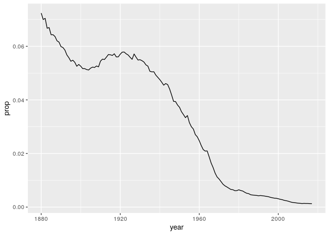<!-- -->

## Your Turn 12

Use summarise() to compute three statistics about the data:

1.  The first (minimum) year in the dataset  
2.  The last (maximum) year in the dataset  
3.  The total number of children represented in the data

<!-- end list -->

``` r
babynames %>% 
  summarise(first = min(year), 
            last = max(year), 
            total = sum(n))
```

    ## # A tibble: 1 x 3
    ##   first  last     total
    ##   <dbl> <dbl>     <int>
    ## 1  1880  2017 348120517

## Your Turn 13

Extract the rows where `name == "Khaleesi"`. Then use `summarise()` and
a summary functions to find:

1.  The total number of children named Khaleesi
2.  The first year Khaleesi appeared in the data

<!-- end list -->

``` r
babynames %>% 
  filter(name == "Khaleesi") %>% 
  summarise(total = sum(n), first = min(year))
```

    ## # A tibble: 1 x 2
    ##   total first
    ##   <int> <dbl>
    ## 1  1964  2011

# Toy dataset for transforming data with dplyr

``` r
pollution <- tribble(
       ~city,   ~size, ~amount, 
  "New York", "large",       23,
  "New York", "small",       14,
    "London", "large",       22,
    "London", "small",       16,
   "Beijing", "large",      121,
   "Beijing", "small",       56
)
```

## Summarize

``` r
pollution %>% 
 summarise(mean = mean(amount), sum = sum(amount), n = n())
```

    ## # A tibble: 1 x 3
    ##    mean   sum     n
    ##   <dbl> <dbl> <int>
    ## 1    42   252     6

``` r
pollution %>% 
  group_by(city) %>%
  summarise(mean = mean(amount), sum = sum(amount), n = n())
```

    ## # A tibble: 3 x 4
    ##   city      mean   sum     n
    ##   <chr>    <dbl> <dbl> <int>
    ## 1 Beijing   88.5   177     2
    ## 2 London    19      38     2
    ## 3 New York  18.5    37     2

## Your Turn 14

Use `group_by()`, `summarise()`, and `arrange()` to display the ten most
popular baby names. Compute popularity as the total number of children
of a single gender given a name.

``` r
babynames %>%
  group_by(name, sex) %>% 
  summarise(total = sum(n)) %>% 
  arrange(desc(total))
```

    ## # A tibble: 107,973 x 3
    ## # Groups:   name [97,310]
    ##    name    sex     total
    ##    <chr>   <chr>   <int>
    ##  1 James   M     5150472
    ##  2 John    M     5115466
    ##  3 Robert  M     4814815
    ##  4 Michael M     4350824
    ##  5 Mary    F     4123200
    ##  6 William M     4102604
    ##  7 David   M     3611329
    ##  8 Joseph  M     2603445
    ##  9 Richard M     2563082
    ## 10 Charles M     2386048
    ## # … with 107,963 more rows

## Your Turn 15

Use grouping to calculate and then plot the number of children born each
year over time.

``` r
babynames %>%
  group_by(year) %>% 
  summarise(n_children = sum(n)) %>% 
  ggplot() +
    geom_line(mapping = aes(x = year, y = n_children))
```

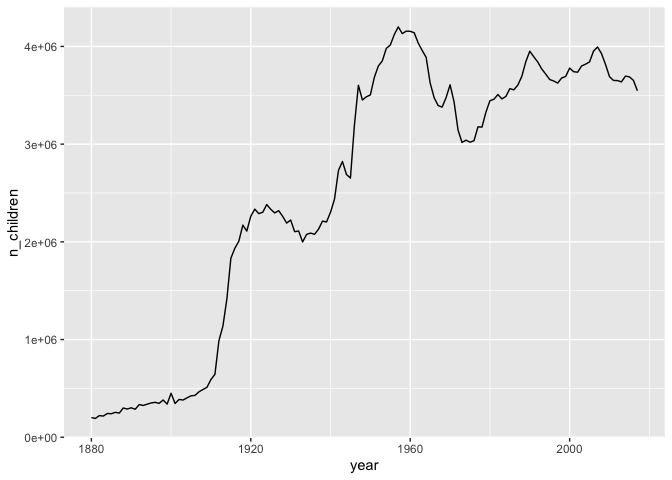<!-- -->

## Ungroup

``` r
babynames %>%
  group_by(name, sex) %>% 
  summarise(total = sum(n)) %>% 
  arrange(desc(total))
```

    ## # A tibble: 107,973 x 3
    ## # Groups:   name [97,310]
    ##    name    sex     total
    ##    <chr>   <chr>   <int>
    ##  1 James   M     5150472
    ##  2 John    M     5115466
    ##  3 Robert  M     4814815
    ##  4 Michael M     4350824
    ##  5 Mary    F     4123200
    ##  6 William M     4102604
    ##  7 David   M     3611329
    ##  8 Joseph  M     2603445
    ##  9 Richard M     2563082
    ## 10 Charles M     2386048
    ## # … with 107,963 more rows

## Mutate

``` r
babynames %>%
  mutate(percent = round(prop*100, 2))
```

    ## # A tibble: 1,924,665 x 6
    ##     year sex   name          n   prop percent
    ##    <dbl> <chr> <chr>     <int>  <dbl>   <dbl>
    ##  1  1880 F     Mary       7065 0.0724    7.24
    ##  2  1880 F     Anna       2604 0.0267    2.67
    ##  3  1880 F     Emma       2003 0.0205    2.05
    ##  4  1880 F     Elizabeth  1939 0.0199    1.99
    ##  5  1880 F     Minnie     1746 0.0179    1.79
    ##  6  1880 F     Margaret   1578 0.0162    1.62
    ##  7  1880 F     Ida        1472 0.0151    1.51
    ##  8  1880 F     Alice      1414 0.0145    1.45
    ##  9  1880 F     Bertha     1320 0.0135    1.35
    ## 10  1880 F     Sarah      1288 0.0132    1.32
    ## # … with 1,924,655 more rows

## Your Turn 16

Use `min_rank()` and `mutate()` to rank each row in `babynames` from
largest `n` to lowest `n`.

``` r
babynames %>% 
  mutate(rank = min_rank(desc(prop)))
```

    ## # A tibble: 1,924,665 x 6
    ##     year sex   name          n   prop  rank
    ##    <dbl> <chr> <chr>     <int>  <dbl> <int>
    ##  1  1880 F     Mary       7065 0.0724    14
    ##  2  1880 F     Anna       2604 0.0267   709
    ##  3  1880 F     Emma       2003 0.0205  1131
    ##  4  1880 F     Elizabeth  1939 0.0199  1192
    ##  5  1880 F     Minnie     1746 0.0179  1427
    ##  6  1880 F     Margaret   1578 0.0162  1683
    ##  7  1880 F     Ida        1472 0.0151  1897
    ##  8  1880 F     Alice      1414 0.0145  2039
    ##  9  1880 F     Bertha     1320 0.0135  2279
    ## 10  1880 F     Sarah      1288 0.0132  2387
    ## # … with 1,924,655 more rows

## Your Turn 17

Compute each name’s rank *within its year and sex*. Then compute the
median rank *for each combination of name and sex*, and arrange the
results from highest median rank to lowest.

``` r
babynames %>% 
  group_by(year, sex) %>% 
  mutate(rank = min_rank(desc(prop))) %>% 
  group_by(name, sex) %>% 
  summarise(score = median(rank)) %>% 
  arrange(score)
```

    ## # A tibble: 107,973 x 3
    ## # Groups:   name [97,310]
    ##    name      sex   score
    ##    <chr>     <chr> <dbl>
    ##  1 Mary      F       1  
    ##  2 James     M       3  
    ##  3 John      M       3  
    ##  4 William   M       4  
    ##  5 Robert    M       6  
    ##  6 Michael   M       7.5
    ##  7 Charles   M       9  
    ##  8 Elizabeth F      10  
    ##  9 Joseph    M      10  
    ## 10 Thomas    M      11  
    ## # … with 107,963 more rows

# Joining data

## Practicing with toy dataset

``` r
band <- tribble(
   ~name,     ~band,
  "Mick",  "Stones",
  "John", "Beatles",
  "Paul", "Beatles"
)

instrument <- tribble(
    ~name,   ~plays,
   "John", "guitar",
   "Paul",   "bass",
  "Keith", "guitar"
)

instrument2 <- tribble(
    ~artist,   ~plays,
   "John", "guitar",
   "Paul",   "bass",
  "Keith", "guitar"
)
```

## Mutating joins

## Types of joins

``` r
band %>% left_join(instrument, by = "name")
```

    ## # A tibble: 3 x 3
    ##   name  band    plays 
    ##   <chr> <chr>   <chr> 
    ## 1 Mick  Stones  <NA>  
    ## 2 John  Beatles guitar
    ## 3 Paul  Beatles bass

``` r
band %>% right_join(instrument, by = "name")
```

    ## # A tibble: 3 x 3
    ##   name  band    plays 
    ##   <chr> <chr>   <chr> 
    ## 1 John  Beatles guitar
    ## 2 Paul  Beatles bass  
    ## 3 Keith <NA>    guitar

``` r
band %>% full_join(instrument, by = "name")
```

    ## # A tibble: 4 x 3
    ##   name  band    plays 
    ##   <chr> <chr>   <chr> 
    ## 1 Mick  Stones  <NA>  
    ## 2 John  Beatles guitar
    ## 3 Paul  Beatles bass  
    ## 4 Keith <NA>    guitar

``` r
band %>% inner_join(instrument, by = "name")
```

    ## # A tibble: 2 x 3
    ##   name  band    plays 
    ##   <chr> <chr>   <chr> 
    ## 1 John  Beatles guitar
    ## 2 Paul  Beatles bass

## Working with different names of variable columns

``` r
band %>% left_join(instrument2, by = c("name" = "artist"))
```

    ## # A tibble: 3 x 3
    ##   name  band    plays 
    ##   <chr> <chr>   <chr> 
    ## 1 Mick  Stones  <NA>  
    ## 2 John  Beatles guitar
    ## 3 Paul  Beatles bass

## Filtering joins

What is the same/different between the two datasets?

``` r
band %>% semi_join(instrument, by = "name")
```

    ## # A tibble: 2 x 2
    ##   name  band   
    ##   <chr> <chr>  
    ## 1 John  Beatles
    ## 2 Paul  Beatles

``` r
band %>% anti_join(instrument, by = "name")
```

    ## # A tibble: 1 x 2
    ##   name  band  
    ##   <chr> <chr> 
    ## 1 Mick  Stones

## Now with flight data

``` r
library(nycflights13)
library(lubridate)
```

    ## 
    ## Attaching package: 'lubridate'

    ## The following object is masked from 'package:base':
    ## 
    ##     date

## Flights data

``` r
flights
```

    ## # A tibble: 336,776 x 19
    ##     year month   day dep_time sched_dep_time dep_delay arr_time sched_arr_time
    ##    <int> <int> <int>    <int>          <int>     <dbl>    <int>          <int>
    ##  1  2013     1     1      517            515         2      830            819
    ##  2  2013     1     1      533            529         4      850            830
    ##  3  2013     1     1      542            540         2      923            850
    ##  4  2013     1     1      544            545        -1     1004           1022
    ##  5  2013     1     1      554            600        -6      812            837
    ##  6  2013     1     1      554            558        -4      740            728
    ##  7  2013     1     1      555            600        -5      913            854
    ##  8  2013     1     1      557            600        -3      709            723
    ##  9  2013     1     1      557            600        -3      838            846
    ## 10  2013     1     1      558            600        -2      753            745
    ## # … with 336,766 more rows, and 11 more variables: arr_delay <dbl>,
    ## #   carrier <chr>, flight <int>, tailnum <chr>, origin <chr>, dest <chr>,
    ## #   air_time <dbl>, distance <dbl>, hour <dbl>, minute <dbl>, time_hour <dttm>

``` r
skim(flights)
```

|                                                  |         |
| :----------------------------------------------- | :------ |
| Name                                             | flights |
| Number of rows                                   | 336776  |
| Number of columns                                | 19      |
| \_\_\_\_\_\_\_\_\_\_\_\_\_\_\_\_\_\_\_\_\_\_\_   |         |
| Column type frequency:                           |         |
| character                                        | 4       |
| numeric                                          | 14      |
| POSIXct                                          | 1       |
| \_\_\_\_\_\_\_\_\_\_\_\_\_\_\_\_\_\_\_\_\_\_\_\_ |         |
| Group variables                                  | None    |

Data summary

**Variable type:
character**

| skim\_variable | n\_missing | complete\_rate | min | max | empty | n\_unique | whitespace |
| :------------- | ---------: | -------------: | --: | --: | ----: | --------: | ---------: |
| carrier        |          0 |           1.00 |   2 |   2 |     0 |        16 |          0 |
| tailnum        |       2512 |           0.99 |   5 |   6 |     0 |      4043 |          0 |
| origin         |          0 |           1.00 |   3 |   3 |     0 |         3 |          0 |
| dest           |          0 |           1.00 |   3 |   3 |     0 |       105 |          0 |

**Variable type:
numeric**

| skim\_variable   | n\_missing | complete\_rate |    mean |      sd |   p0 |  p25 |  p50 |  p75 | p100 | hist  |
| :--------------- | ---------: | -------------: | ------: | ------: | ---: | ---: | ---: | ---: | ---: | :---- |
| year             |          0 |           1.00 | 2013.00 |    0.00 | 2013 | 2013 | 2013 | 2013 | 2013 | ▁▁▇▁▁ |
| month            |          0 |           1.00 |    6.55 |    3.41 |    1 |    4 |    7 |   10 |   12 | ▇▆▆▆▇ |
| day              |          0 |           1.00 |   15.71 |    8.77 |    1 |    8 |   16 |   23 |   31 | ▇▇▇▇▆ |
| dep\_time        |       8255 |           0.98 | 1349.11 |  488.28 |    1 |  907 | 1401 | 1744 | 2400 | ▁▇▆▇▃ |
| sched\_dep\_time |          0 |           1.00 | 1344.25 |  467.34 |  106 |  906 | 1359 | 1729 | 2359 | ▁▇▇▇▃ |
| dep\_delay       |       8255 |           0.98 |   12.64 |   40.21 | \-43 |  \-5 |  \-2 |   11 | 1301 | ▇▁▁▁▁ |
| arr\_time        |       8713 |           0.97 | 1502.05 |  533.26 |    1 | 1104 | 1535 | 1940 | 2400 | ▁▃▇▇▇ |
| sched\_arr\_time |          0 |           1.00 | 1536.38 |  497.46 |    1 | 1124 | 1556 | 1945 | 2359 | ▁▃▇▇▇ |
| arr\_delay       |       9430 |           0.97 |    6.90 |   44.63 | \-86 | \-17 |  \-5 |   14 | 1272 | ▇▁▁▁▁ |
| flight           |          0 |           1.00 | 1971.92 | 1632.47 |    1 |  553 | 1496 | 3465 | 8500 | ▇▃▃▁▁ |
| air\_time        |       9430 |           0.97 |  150.69 |   93.69 |   20 |   82 |  129 |  192 |  695 | ▇▂▂▁▁ |
| distance         |          0 |           1.00 | 1039.91 |  733.23 |   17 |  502 |  872 | 1389 | 4983 | ▇▃▂▁▁ |
| hour             |          0 |           1.00 |   13.18 |    4.66 |    1 |    9 |   13 |   17 |   23 | ▁▇▇▇▅ |
| minute           |          0 |           1.00 |   26.23 |   19.30 |    0 |    8 |   29 |   44 |   59 | ▇▃▆▃▅ |

**Variable type:
POSIXct**

| skim\_variable | n\_missing | complete\_rate | min                 | max                 | median              | n\_unique |
| :------------- | ---------: | -------------: | :------------------ | :------------------ | :------------------ | --------: |
| time\_hour     |          0 |              1 | 2013-01-01 05:00:00 | 2013-12-31 23:00:00 | 2013-07-03 10:00:00 |      6936 |

## Your Turn 18

Which airlines had the largest arrival delays? Work in groups to
complete the code below.

1.  Join `airlines` to `flights`
2.  Compute and order the average arrival delays by airline. Display
    full names, no codes.

<!-- end list -->

``` r
flights %>% 
  drop_na(arr_delay) %>%
  left_join(airlines, by = "carrier") %>%
  group_by(name) %>%
  summarise(delay = mean(arr_delay)) %>%
  arrange(delay)
```

    ## # A tibble: 16 x 2
    ##    name                         delay
    ##    <chr>                        <dbl>
    ##  1 Alaska Airlines Inc.        -9.93 
    ##  2 Hawaiian Airlines Inc.      -6.92 
    ##  3 American Airlines Inc.       0.364
    ##  4 Delta Air Lines Inc.         1.64 
    ##  5 Virgin America               1.76 
    ##  6 US Airways Inc.              2.13 
    ##  7 United Air Lines Inc.        3.56 
    ##  8 Endeavor Air Inc.            7.38 
    ##  9 JetBlue Airways              9.46 
    ## 10 Southwest Airlines Co.       9.65 
    ## 11 Envoy Air                   10.8  
    ## 12 SkyWest Airlines Inc.       11.9  
    ## 13 Mesa Airlines Inc.          15.6  
    ## 14 ExpressJet Airlines Inc.    15.8  
    ## 15 AirTran Airways Corporation 20.1  
    ## 16 Frontier Airlines Inc.      21.9

## Different names of variable columns

``` r
airports %>% left_join(flights, by = c("faa" = "dest"))
```

    ## # A tibble: 330,531 x 26
    ##    faa   name    lat    lon   alt    tz dst   tzone  year month   day dep_time
    ##    <chr> <chr> <dbl>  <dbl> <dbl> <dbl> <chr> <chr> <int> <int> <int>    <int>
    ##  1 04G   Lans…  41.1  -80.6  1044    -5 A     Amer…    NA    NA    NA       NA
    ##  2 06A   Moto…  32.5  -85.7   264    -6 A     Amer…    NA    NA    NA       NA
    ##  3 06C   Scha…  42.0  -88.1   801    -6 A     Amer…    NA    NA    NA       NA
    ##  4 06N   Rand…  41.4  -74.4   523    -5 A     Amer…    NA    NA    NA       NA
    ##  5 09J   Jeky…  31.1  -81.4    11    -5 A     Amer…    NA    NA    NA       NA
    ##  6 0A9   Eliz…  36.4  -82.2  1593    -5 A     Amer…    NA    NA    NA       NA
    ##  7 0G6   Will…  41.5  -84.5   730    -5 A     Amer…    NA    NA    NA       NA
    ##  8 0G7   Fing…  42.9  -76.8   492    -5 A     Amer…    NA    NA    NA       NA
    ##  9 0P2   Shoe…  39.8  -76.6  1000    -5 U     Amer…    NA    NA    NA       NA
    ## 10 0S9   Jeff…  48.1 -123.    108    -8 A     Amer…    NA    NA    NA       NA
    ## # … with 330,521 more rows, and 14 more variables: sched_dep_time <int>,
    ## #   dep_delay <dbl>, arr_time <int>, sched_arr_time <int>, arr_delay <dbl>,
    ## #   carrier <chr>, flight <int>, tailnum <chr>, origin <chr>, air_time <dbl>,
    ## #   distance <dbl>, hour <dbl>, minute <dbl>, time_hour <dttm>

## Your Turn 19

Find the average delay by destination airport. Find the average delay by
*origin* airport.

``` r
flights %>%
  drop_na(arr_delay) %>%
  group_by(dest) %>% 
  summarise(delay = mean(arr_delay)) %>%
  left_join(airports, by = c("dest" = "faa")) %>%
  select(name, delay) %>%
  arrange(desc(delay))
```

    ## # A tibble: 104 x 2
    ##    name                          delay
    ##    <chr>                         <dbl>
    ##  1 Columbia Metropolitan          41.8
    ##  2 Tulsa Intl                     33.7
    ##  3 Will Rogers World              30.6
    ##  4 Jackson Hole Airport           28.1
    ##  5 Mc Ghee Tyson                  24.1
    ##  6 Dane Co Rgnl Truax Fld         20.2
    ##  7 Richmond Intl                  20.1
    ##  8 Akron Canton Regional Airport  19.7
    ##  9 Des Moines Intl                19.0
    ## 10 Gerald R Ford Intl             18.2
    ## # … with 94 more rows

## Filtering joins

## Your Turn 20

How many airports in `airports` are serviced by flights originating in
New York (i.e. flights in our dataset?) Notice that the column to join
on is named `faa` in the **airports** data set and `dest` in the
**flights** data set.

``` r
airports %>%
  semi_join(flights, by = c("faa" = "dest")) %>%
  distinct(faa)
```

    ## # A tibble: 101 x 1
    ##    faa  
    ##    <chr>
    ##  1 ABQ  
    ##  2 ACK  
    ##  3 ALB  
    ##  4 ANC  
    ##  5 ATL  
    ##  6 AUS  
    ##  7 AVL  
    ##  8 BDL  
    ##  9 BGR  
    ## 10 BHM  
    ## # … with 91 more rows

# Charachter strings

Predict what these might return:

``` r
strings <- c("Apple", "Pineapple", "Orange")

str_detect(strings, pattern = "pp")
```

    ## [1]  TRUE  TRUE FALSE

``` r
str_detect(strings, pattern =  "apple")
```

    ## [1] FALSE  TRUE FALSE

``` r
str_detect(strings, pattern = "[Aa]pple")
```

    ## [1]  TRUE  TRUE FALSE

# Finally getting to ggplot2 - Yea\!

  - Start with `ggplot()`
  - Supply a dataset and aesthetic mapping (with `aes()`)
  - Add on layers (like `geom_point()` or `geom_histogram()`)
  - Add on scales (like `scale_colour_brewer()`)
  - Add on faceting specifications (like `facet_wrap()`)
  - Add on coordinate systems (like `coord_flip`)

## Start with Bechdel test data

This data on movies and [the Bechdel
test](https://en.wikipedia.org/wiki/Bechdel_test) was collected by the
website FiveThirtyEight. The Bechdel test is a measure of the
representation of women in fiction. It asks whether a work features at
least two women who talk to each other about something other than a man.

Preview the data.

``` r
bechdel
```

    ## # A tibble: 1,794 x 15
    ##     year imdb  title test  clean_test binary budget domgross intgross code 
    ##    <int> <chr> <chr> <chr> <ord>      <chr>   <int>    <dbl>    <dbl> <chr>
    ##  1  2013 tt17… 21 &… nota… notalk     FAIL   1.30e7 25682380   4.22e7 2013…
    ##  2  2012 tt13… Dred… ok-d… ok         PASS   4.50e7 13414714   4.09e7 2012…
    ##  3  2013 tt20… 12 Y… nota… notalk     FAIL   2.00e7 53107035   1.59e8 2013…
    ##  4  2013 tt12… 2 Gu… nota… notalk     FAIL   6.10e7 75612460   1.32e8 2013…
    ##  5  2013 tt04… 42    men   men        FAIL   4.00e7 95020213   9.50e7 2013…
    ##  6  2013 tt13… 47 R… men   men        FAIL   2.25e8 38362475   1.46e8 2013…
    ##  7  2013 tt16… A Go… nota… notalk     FAIL   9.20e7 67349198   3.04e8 2013…
    ##  8  2013 tt21… Abou… ok-d… ok         PASS   1.20e7 15323921   8.73e7 2013…
    ##  9  2013 tt18… Admi… ok    ok         PASS   1.30e7 18007317   1.80e7 2013…
    ## 10  2013 tt18… Afte… nota… notalk     FAIL   1.30e8 60522097   2.44e8 2013…
    ## # … with 1,784 more rows, and 5 more variables: budget_2013 <int>,
    ## #   domgross_2013 <dbl>, intgross_2013 <dbl>, period_code <int>,
    ## #   decade_code <int>

## Consider

What relationship do you expect to see between movie budget (budget) and
domestic gross(domgross)?

## Your Turn 25

Run the code in the chunk to make a graph.

``` r
ggplot(data = bechdel) +
  geom_point(mapping = aes(x = budget, y = domgross))
```

    ## Warning: Removed 17 rows containing missing values (geom_point).

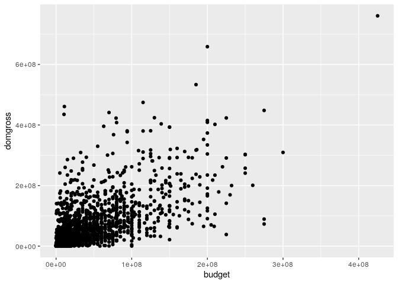<!-- -->

## Your Turn 26

Add `color`, `size`, `alpha`, and `shape` aesthetics to your graph.
Experiment.

``` r
ggplot(data = bechdel) +
  geom_point(mapping = aes(x = budget, y = domgross, color=clean_test))
```

    ## Warning: Removed 17 rows containing missing values (geom_point).

<!-- -->

``` r
ggplot(bechdel) + 
  geom_point(mapping = aes(x = budget, y = domgross, size=clean_test))
```

    ## Warning: Removed 17 rows containing missing values (geom_point).

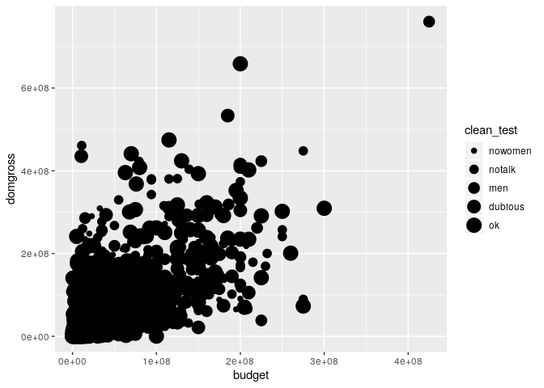<!-- -->

``` r
ggplot(bechdel) + 
  geom_point(mapping = aes(x = budget, y = domgross, shape=clean_test))
```

    ## Warning: Using shapes for an ordinal variable is not advised
    
    ## Warning: Removed 17 rows containing missing values (geom_point).

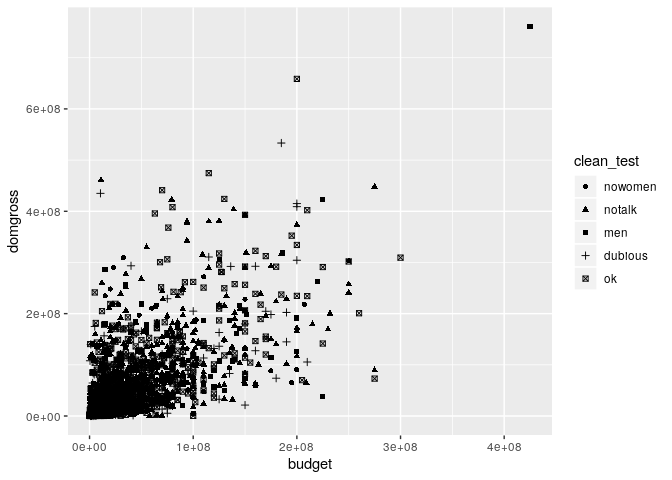<!-- -->

``` r
ggplot(bechdel) + 
  geom_point(mapping = aes(x = budget, y = domgross, alpha=clean_test))
```

    ## Warning: Removed 17 rows containing missing values (geom_point).

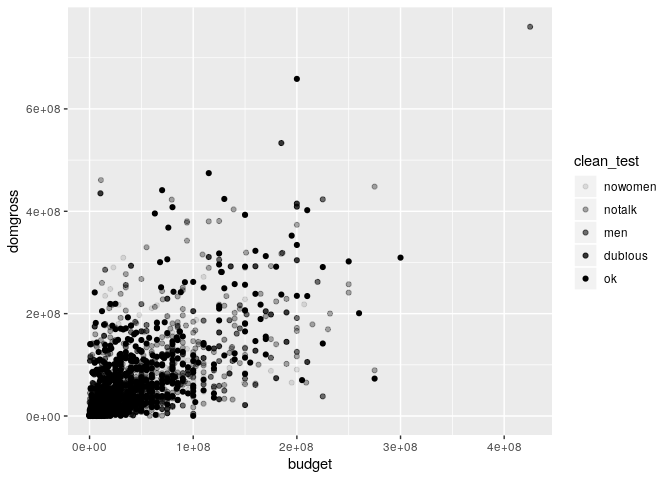<!-- -->

## Declaring the color outside of the aes mapping

``` r
ggplot(bechdel) + 
    geom_point(mapping = aes(x = budget, y = domgross), color="blue")
```

    ## Warning: Removed 17 rows containing missing values (geom_point).

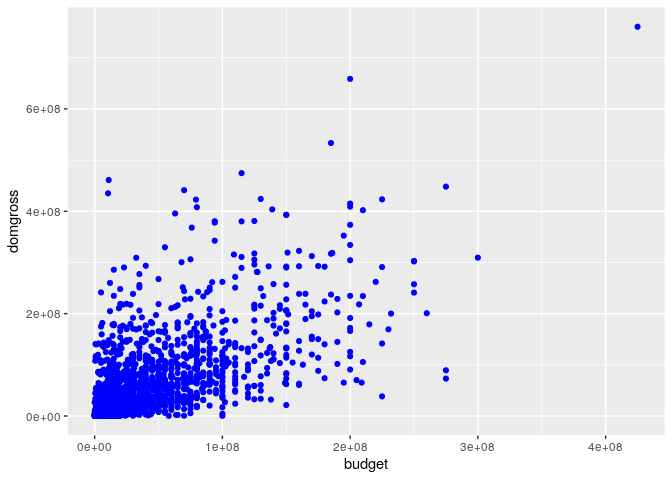<!-- -->

## Your Turn 27

Replace this scatterplot with one that draws
boxplots.

``` r
ggplot(data = bechdel) + geom_point(aes(x = clean_test, y = budget))
```

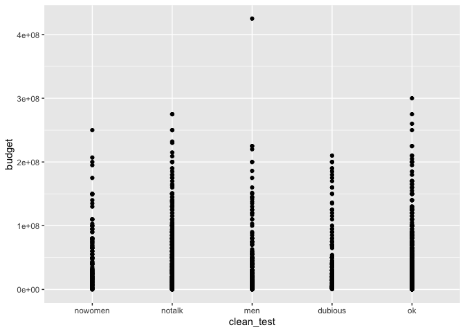<!-- -->

``` r
ggplot(data = bechdel) + geom_boxplot(aes(x = clean_test, y = budget), color = "dark green")
```

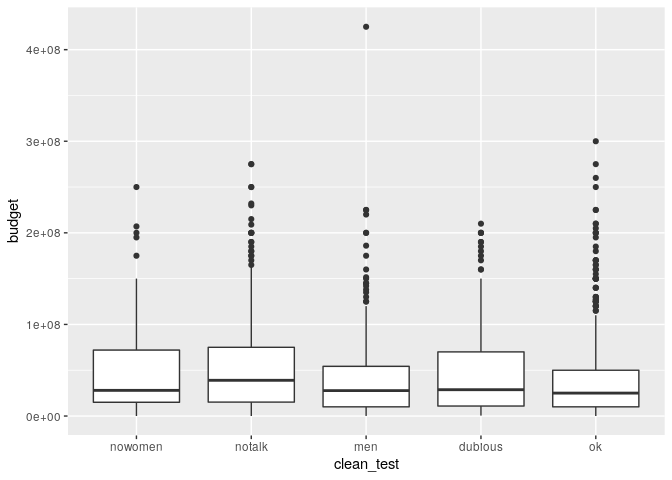<!-- -->

## Your Turn 28

Make a histogram of the `budget` variable from `bechdel`.

``` r
ggplot(bechdel) + 
  geom_histogram(aes(x=budget))
```

    ## `stat_bin()` using `bins = 30`. Pick better value with `binwidth`.

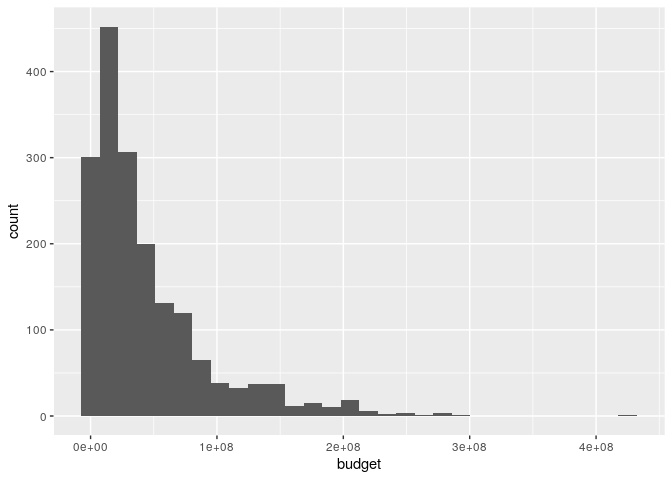<!-- -->

## Your Turn 29

Try to find a better binwidth for `budget`.

``` r
ggplot(data = bechdel) +
  geom_histogram(mapping = aes(x = budget), binwidth=10000000)
```

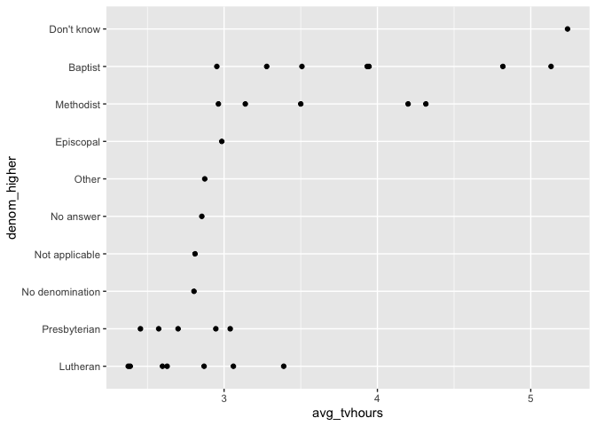<!-- -->

## Your Turn 30

Make a density plot of `budget` colored by `clean_test`.

``` r
ggplot(data = bechdel) +
  geom_density(mapping = aes(x = budget))
```

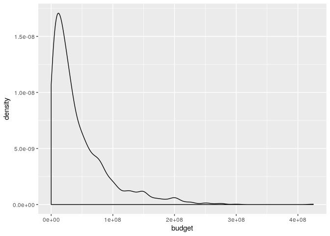<!-- -->

``` r
ggplot(data = bechdel) +
  geom_density(mapping = aes(x = budget, color=clean_test))
```

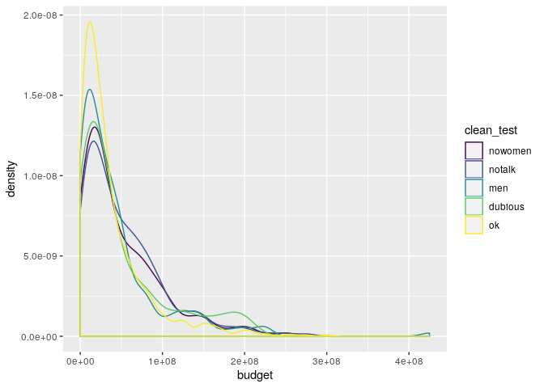<!-- -->

## Your Turn 31

Make a barchart of `clean_test` colored by `clean_test`.

``` r
ggplot(data=bechdel) +
  geom_bar(mapping = aes(x = clean_test, fill = clean_test))
```

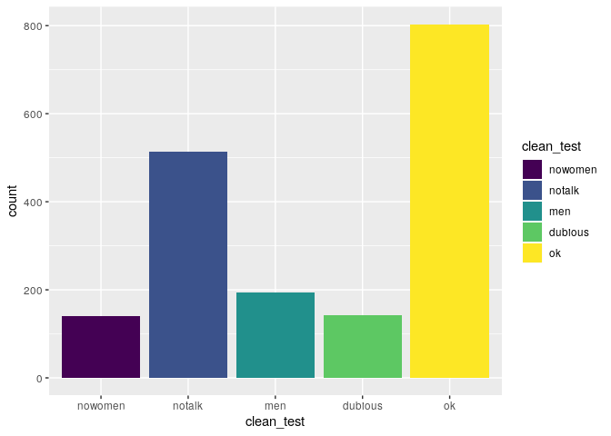<!-- -->

## Your Turn 32

Predict what this code will do. Then run it.

``` r
ggplot(bechdel) + 
  geom_point(aes(budget, domgross)) +
  geom_smooth(aes(budget, domgross))
```

    ## `geom_smooth()` using method = 'gam' and formula 'y ~ s(x, bs = "cs")'

    ## Warning: Removed 17 rows containing non-finite values (stat_smooth).

    ## Warning: Removed 17 rows containing missing values (geom_point).

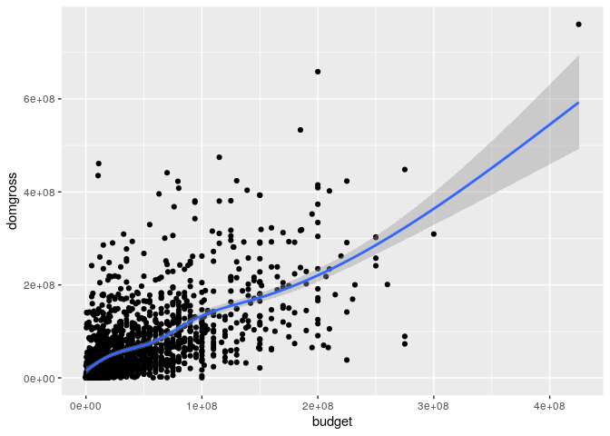<!-- -->

## global vs local

``` r
ggplot(data = bechdel, mapping = aes(x = budget, y = domgross)) +
  geom_point(mapping = aes(color = clean_test)) +
  geom_smooth()
```

    ## `geom_smooth()` using method = 'gam' and formula 'y ~ s(x, bs = "cs")'

    ## Warning: Removed 17 rows containing non-finite values (stat_smooth).

    ## Warning: Removed 17 rows containing missing values (geom_point).

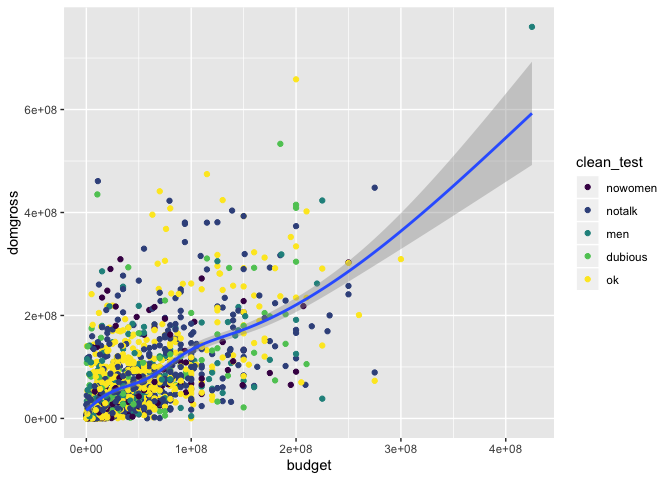<!-- -->

``` r
library(dplyr)
ggplot(data = bechdel, mapping = aes(x = budget, y = domgross)) +
  geom_point(mapping = aes(color = clean_test)) +
  geom_smooth(data = filter(bechdel, clean_test == "ok"))
```

    ## `geom_smooth()` using method = 'loess' and formula 'y ~ x'

    ## Warning: Removed 9 rows containing non-finite values (stat_smooth).

    ## Warning: Removed 17 rows containing missing values (geom_point).

<!-- -->

## Your Turn 33

Save the last
    plot.

``` r
ggsave("my-plot.png")
```

    ## Saving 7 x 5 in image

    ## `geom_smooth()` using method = 'loess' and formula 'y ~ x'

    ## Warning: Removed 9 rows containing non-finite values (stat_smooth).

    ## Warning: Removed 17 rows containing missing values (geom_point).

``` r
ggsave("my-plot.pdf", width = 6, height = 6)
```

    ## `geom_smooth()` using method = 'loess' and formula 'y ~ x'

    ## Warning: Removed 9 rows containing non-finite values (stat_smooth).
    
    ## Warning: Removed 17 rows containing missing values (geom_point).

# Data types

What kind of object is the `marital` variable?

``` r
gss_cat
```

    ## # A tibble: 21,483 x 9
    ##     year marital     age race  rincome    partyid     relig     denom    tvhours
    ##    <int> <fct>     <int> <fct> <fct>      <fct>       <fct>     <fct>      <int>
    ##  1  2000 Never ma…    26 White $8000 to … Ind,near r… Protesta… Souther…      12
    ##  2  2000 Divorced     48 White $8000 to … Not str re… Protesta… Baptist…      NA
    ##  3  2000 Widowed      67 White Not appli… Independent Protesta… No deno…       2
    ##  4  2000 Never ma…    39 White Not appli… Ind,near r… Orthodox… Not app…       4
    ##  5  2000 Divorced     25 White Not appli… Not str de… None      Not app…       1
    ##  6  2000 Married      25 White $20000 - … Strong dem… Protesta… Souther…      NA
    ##  7  2000 Never ma…    36 White $25000 or… Not str re… Christian Not app…       3
    ##  8  2000 Divorced     44 White $7000 to … Ind,near d… Protesta… Luthera…      NA
    ##  9  2000 Married      44 White $25000 or… Not str de… Protesta… Other          0
    ## 10  2000 Married      47 White $25000 or… Strong rep… Protesta… Souther…       3
    ## # … with 21,473 more rows

  - Factors are R’s way of storing categorical data.
  - They have a set of allowable values called **levels**.
  - Internally they are stored as integers.

Using the data `gss_cat`, find the average hours of tv watched
(`tvhours`) for each category of marital status (`marital`).

``` r
gss_cat %>%
  group_by(marital) %>% 
  summarise(avg_tv = mean(tvhours))
```

    ## # A tibble: 6 x 2
    ##   marital       avg_tv
    ##   <fct>          <dbl>
    ## 1 No answer         NA
    ## 2 Never married     NA
    ## 3 Separated         NA
    ## 4 Divorced          NA
    ## 5 Widowed           NA
    ## 6 Married           NA

Is this likely?

## Your Turn 21

Fix your summary of average hours of tv watched (`tvhours`) by marital
status (`marital`), to drop missing values in `tvhours`, then create a
plot to examine the results.

``` r
gss_cat %>%
  drop_na(tvhours) %>%
  group_by(marital) %>% 
  summarise(avg_tvhours = mean(tvhours)) %>%
  ggplot() +
    geom_point(aes(avg_tvhours, marital))
```

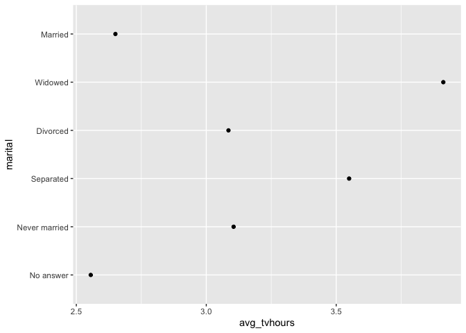<!-- -->

## Your Turn 22

Explore the average hours of tv watched by religion.

``` r
gss_cat %>%
  drop_na(tvhours) %>%
  group_by(relig) %>%
  summarise(avg_tvhours = mean(tvhours)) %>%
  ggplot() +
    geom_point(mapping = aes(x = avg_tvhours, 
      y = fct_reorder(relig, avg_tvhours)))
```

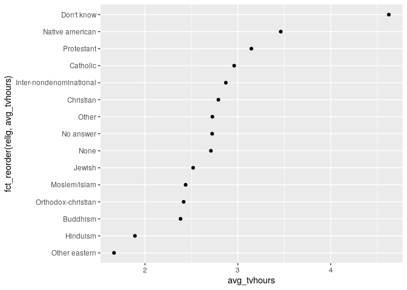<!-- -->

# Quiz

Why is this plot not very useful?

``` r
gss_cat %>%
  drop_na(tvhours) %>%
  group_by(denom) %>%
  summarise(avg_tvhours = mean(tvhours)) %>%
  ggplot() +
    geom_point(mapping = aes(x = avg_tvhours,
      y = fct_reorder(denom, avg_tvhours)))
```

<!-- -->

There are too many categories, and the categories are poorly labelled.

## Your Turn 23

Edit the code to also relabel some other Baptist denominations:

  - “Baptist-dk which”  
  - “Other baptists”

<!-- end list -->

``` r
gss_cat %>%
  mutate(denom = fct_recode(denom,
    "Baptist - Southern" = "Southern baptist",
    "Baptist - Don't know" = "Baptist-dk which",
    "Baptist - Other" = "Other baptists")
  ) %>%
  pull(denom) %>%
  levels()
```

    ##  [1] "No answer"            "Don't know"           "No denomination"     
    ##  [4] "Other"                "Episcopal"            "Presbyterian-dk wh"  
    ##  [7] "Presbyterian, merged" "Other presbyterian"   "United pres ch in us"
    ## [10] "Presbyterian c in us" "Lutheran-dk which"    "Evangelical luth"    
    ## [13] "Other lutheran"       "Wi evan luth synod"   "Lutheran-mo synod"   
    ## [16] "Luth ch in america"   "Am lutheran"          "Methodist-dk which"  
    ## [19] "Other methodist"      "United methodist"     "Afr meth ep zion"    
    ## [22] "Afr meth episcopal"   "Baptist - Don't know" "Baptist - Other"     
    ## [25] "Baptist - Southern"   "Nat bapt conv usa"    "Nat bapt conv of am" 
    ## [28] "Am bapt ch in usa"    "Am baptist asso"      "Not applicable"

## Your Turn 24

What does the function `detect_denom()` do?

``` r
detect_denom <- function(x){
  case_when(
    str_detect(x, "[Bb]ap") ~ "Baptist", 
    str_detect(x, "[Pp]res") ~ "Presbyterian",
    str_detect(x, "[Ll]uth") ~ "Lutheran",
    str_detect(x, "[Mm]eth") ~ "Methodist",
    TRUE ~ x
  )
}

gss_cat %>% pull(denom) %>% levels() %>% detect_denom()
```

    ##  [1] "No answer"       "Don't know"      "No denomination" "Other"          
    ##  [5] "Episcopal"       "Presbyterian"    "Presbyterian"    "Presbyterian"   
    ##  [9] "Presbyterian"    "Presbyterian"    "Lutheran"        "Lutheran"       
    ## [13] "Lutheran"        "Lutheran"        "Lutheran"        "Lutheran"       
    ## [17] "Lutheran"        "Methodist"       "Methodist"       "Methodist"      
    ## [21] "Methodist"       "Methodist"       "Baptist"         "Baptist"        
    ## [25] "Baptist"         "Baptist"         "Baptist"         "Baptist"        
    ## [29] "Baptist"         "Not applicable"

It tries to detect a higher level grouping by looking for patterns in
the denomination strings.

This is ideal for combining with `fct_revel()`:

``` r
gss_cat %>%
  drop_na(tvhours) %>%
  mutate(denom_higher = fct_relabel(denom, detect_denom) %>%
      fct_reorder(tvhours, mean)) %>%
  group_by(denom_higher, denom) %>%
  summarise(avg_tvhours = mean(tvhours)) %>%
  ggplot() +
    geom_point(mapping = aes(x = avg_tvhours,
      y = denom_higher)) 
```

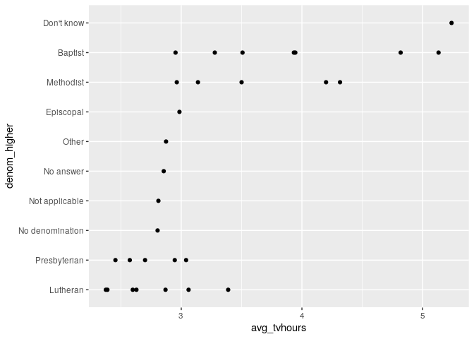<!-- -->

# Take aways

  - Extract variables with `select()`  

  - Extract cases with `filter()`  

  - Arrange cases, with `arrange()`

  - Make tables of summaries with `summarise()`  

  - Make new variables, with `mutate()`  

  - Do groupwise operations with `group_by()`

  - Connect operations with `%>%`

  - Use `left_join()`, `right_join()`, `full_join()`, or `inner_join()`
    to join datasets

  - Use `semi_join()` or `anti_join()` to filter datasets against each
    other
