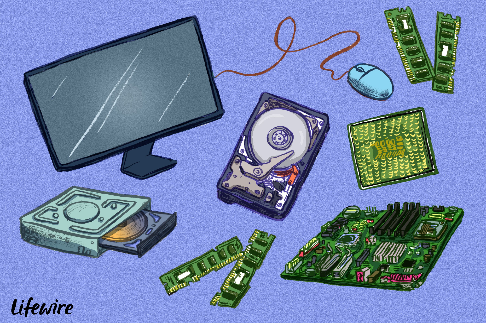
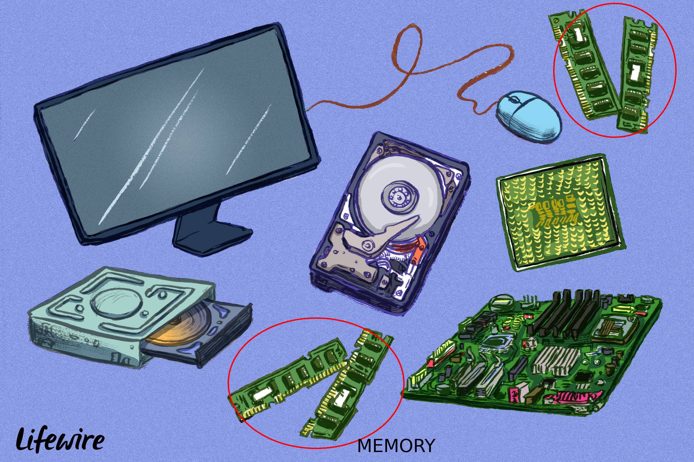
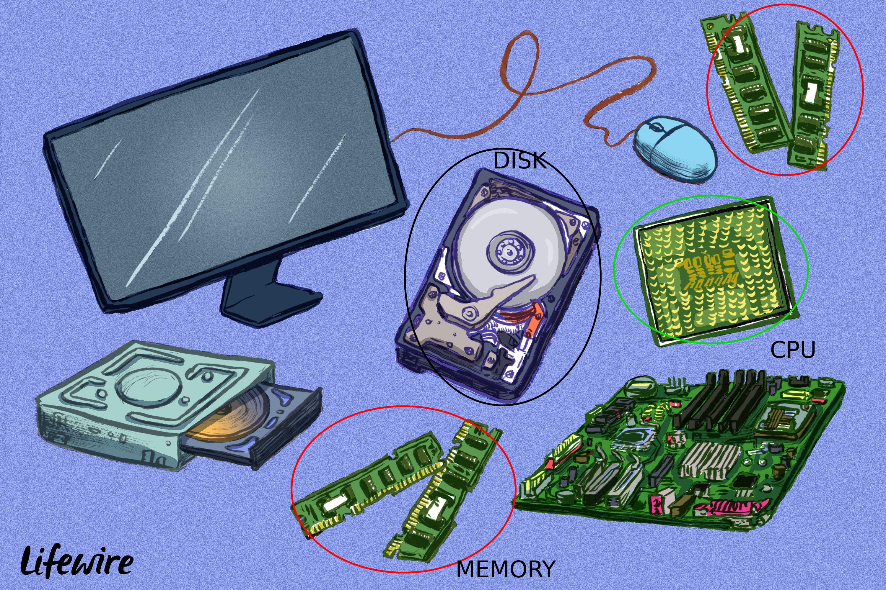

```{r setup, include=FALSE}
options(htmltools.dir.version = FALSE)
library(xaringanthemer)
style_solarized_light()
```

class: center, inverse

# Some notes on R and error messages

## Julia Romanowska


### 15 June 2020

---

# OVERVIEW

- PROGRAMMING BASICS
    <!-- - CPU, disk, memory = computer -->
    <!-- - memory mapping -->
    <!-- - code can crash due to lack of memory -->
- R BASICS
    <!-- - variable -->
    <!-- - function -->
    <!-- - argument -->
    <!-- - object ~ closure -->
    <!-- - what happens under the hood? -->
    <!-- - ?? lazy evaluation ?? -->
    <!-- - !! __environment__ !! -->
    <!--   - very important when writing functions -->
    <!--   - also important when knitting Rmarkdown file -->
    <!--   - sometimes it helps to solve a problem by restarting R and re-running the code -->

- FUNCTIONS THAT HELP FIND THE SOURCE OF ERROR
    <!-- - ``traceback()`` -->
    <!-- - ``browser()`` -->
    <!-- - from the ``rlang`` package: ``last_error()``, ``last_trace()``, and ``trace_back()`` -->

- WHERE TO SEARCH FOR HELP?
    <!-- - manual pages: https://aosmith.rbind.io/2020/04/28/r-documentation/ -->
    <!-- - cheatsheets -->
    <!-- - RStudio webpages -->
    <!-- - RLadies slack -->
    <!-- - stackoverflow -->

---

# PROGRAMMING BASICS



???

The computer is made of many parts and nowadays, we do not need to know about
all of them, but three parts are essential to know about.

---

# PROGRAMMING BASICS



???

First - **the memory**, also known as RAM. This is where all the stuff sits
when we're working on our computer. Every program, in order to work, must
be read into memory. Nowadays, computers tend to have quite large RAM, so
usually we don't need to worry about optimizing our code to fit in the memory,
but we need to remember that all the data takes space and the variables that
we create take space, and the operations that we envoke need space, perhaps
sometimes double of the one that the input data require. Thus, often, when
the code just hangs, it might be as simple as running out of memory.

---

# PROGRAMMING BASICS


???

Then - we have **the CPU**, which is the executive mode of the computer. It
takes data from RAM, performs a certain operation and spits the result out also
into memory. Nowadays, we have actually more than one computing node on our
CPU - called _cores_, which again might split the calculations into several
_threads_.

Thus, CPU communicates only with RAM and this communication is quite fast.

---

# PROGRAMMING BASICS



???

What can be slow is **disk operations**. The disk, or hard drive, stores data
and, in contrast to RAM, does not need energy to keep the data. It is much
bigger than the memory, but also much slower. All the data before making use of
it, needs to be read into the memory, and then usually write to disk after
calculations. One type of error that might occur is when we run out of space on
the disk, or we do not have permissions to write to a specific part of the disk.

---

# PROGRAMMING BASICS

Successful program - requirements:

- _enough memory_
- _all variables present_
- _enough disk space_
- _permission to read/write_

---

# R BASICS


