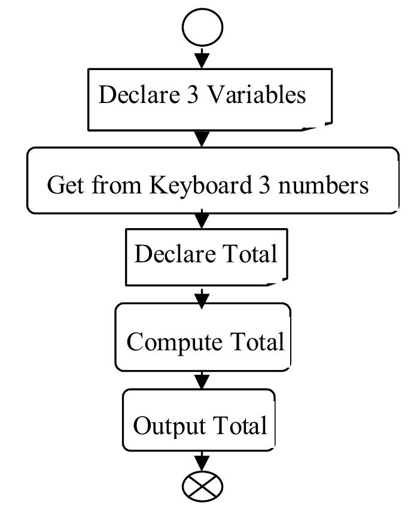

```{r setup, include=FALSE}
options(htmltools.dir.version = FALSE)
knitr::opts_chunk$set(
  fig.width=9, fig.height=3.5, fig.retina=3,
  out.width = "100%",
  cache = FALSE,
  echo = TRUE,
  message = FALSE, 
  warning = FALSE,
  hiline = TRUE
)
library(fontawesome)
library(xaringanthemer)
style_duo_accent(
  primary_color = "#1381B0",
  secondary_color = "#FF961C",
  inverse_header_color = "#FFFFFF"
)
library(xaringanExtra)
use_scribble()
use_fit_screen()
```

background-image: url("figs/greg-rosenke-WX4LFn24RxQ-unsplash.jpg")
background-size: cover

class: left, top, inverse

<p style="font-weight: 900; font-family: Georgia; font-size: 2.5rem; color: white; text-shadow: 2px 2px black;">
How not to panic
</p>

<p style="font-weight: 900; font-family: Georgia; font-size: 2rem; color: white; text-shadow: 2px 2px black;">
in face of an error message
</p>

<br>
<br>
<br>
<br>
<p style="font-weight: 900; font-family: Georgia; font-size: 1.8rem; color: white; text-shadow: 2px 2px black;">
Julia Romanowska
</p>

<p style="font-weight: 900; font-family: Georgia; font-size: 1rem; color: white; text-shadow: 2px 2px black;">
May 12, 2022
</p>


<p style="font-size: 12pt; font-weight: bold; right: 10px; bottom: 20px; position: absolute; ">
Photo by <a href="https://unsplash.com/@greg_rosenke?utm_source=unsplash&utm_medium=referral&utm_content=creditCopyText">Greg Rosenke</a> on <a href="https://unsplash.com/?utm_source=unsplash&utm_medium=referral&utm_content=creditCopyText">Unsplash</a>
</p>

---

class: inverse, right, middle

## Overview

### Computer basics

### Types of instructions

### How to translate a problem?

### Program execution

### Exercise

---

### Computer basics

> _What is a computer?_

.pull-left[
**Physical machine**

- CPU

- RAM

- disk
]

--

.pull-right[
**Mental model**

- instructions

- processing:
  1. input
  2. store / analyse
  3. output
]

???

In each of these three steps there can be an error!

---

### Types of instructions

.pull-left[
**1. Declaration**

> **variable** = space allocated in RAM to hold some data

- **variable type**
  - character/string
  - numeric
  - date

- *example*    
`String name`

**2. Input**

- from keyboard or from file

- *example*    
`KeyboardRead name`

]

???

Various types can have various features - e.g., we cannot perform an addition
on two character variables.

--

.pull-right[
**3. Output**

- to a file or to the screen (*standard output*)

- *example*    
`ScreenWrite "Good morning, dear ", name`

**4. Assignment**

- *example*    
`var_name <- value`    
`var_name <- expression`


]

---

### How to translate a problem?

- Problem in natural language:    
*Compute sum of three numbers given by the user*

--

.pull-left[
Build a flowchart of the process!

*building blocks*


]

--

.pull-right[


]

???

Let's write pseudo-code for that.

---

### Program execution

- _program state:_
  - variables in memory
  - values
  - next instruction

> **Example**

.pull-left[
**Program area**

```
[x] Numeric a, b, c
[ ] KeyboardRead a
[ ] KeyboardRead b
[ ] KeyboardRead c
[ ] Numeric total
[ ] total <- a + b + c
[ ] ScreenWrite "Sum is equal to ", total
```
]

.pull-right[
**Data area**

_(empty)_
]

---

### Program execution

- _program state:_
  - variables in memory
  - values
  - next instruction

> **Example**

.pull-left[
**Program area**

```
[ ] Numeric a, b, c
[x] KeyboardRead a
[ ] KeyboardRead b
[ ] KeyboardRead c
[ ] Numeric total
[ ] total <- a + b + c
[ ] ScreenWrite "Sum is equal to ", total
```
]

.pull-right[
**Data area**

 `a`  |  `b`  |  `c` |
:----:|:-----:|:----:|
 `NA` | `NA`  | `NA` |

]

---
### Program execution

- _program state:_
  - variables in memory
  - values
  - next instruction

> **Example**

.pull-left[
**Program area**

```
[ ] Numeric a, b, c
[ ] KeyboardRead a
[x] KeyboardRead b
[ ] KeyboardRead c
[ ] Numeric total
[ ] total <- a + b + c
[ ] ScreenWrite "Sum is equal to ", total
```
]

.pull-right[
**Data area**

 `a`  |  `b`  |  `c` |
:----:|:-----:|:----:|
 `19` | `NA`  | `NA` |

]

---
### Program execution

- _program state:_
  - variables in memory
  - values
  - next instruction

> **Example**

.pull-left[
**Program area**

```
[ ] Numeric a, b, c
[ ] KeyboardRead a
[ ] KeyboardRead b
[x] KeyboardRead c
[ ] Numeric total
[ ] total <- a + b + c
[ ] ScreenWrite "Sum is equal to ", total
```
]

.pull-right[
**Data area**

 `a`  |  `b`  |  `c` |
:----:|:-----:|:----:|
 `19` | `2`  | `NA` |

]

---
### Program execution

- _program state:_
  - variables in memory
  - values
  - next instruction

> **Example**

.pull-left[
**Program area**

```
[ ] Numeric a, b, c
[ ] KeyboardRead a
[ ] KeyboardRead b
[ ] KeyboardRead c
[x] Numeric total
[ ] total <- a + b + c
[ ] ScreenWrite "Sum is equal to ", total
```
]

.pull-right[
**Data area**

 `a`  |  `b`  |  `c` |
:----:|:-----:|:----:|
 `19` | `2`  | `126` |

]

---
### Program execution

- _program state:_
  - variables in memory
  - values
  - next instruction

> **Example**

.pull-left[
**Program area**

```
[ ] Numeric a, b, c
[ ] KeyboardRead a
[ ] KeyboardRead b
[ ] KeyboardRead c
[ ] Numeric total
[x] total <- a + b + c
[ ] ScreenWrite "Sum is equal to ", total
```
]

.pull-right[
**Data area**

 `a`  |  `b`  |  `c` | `total` |
:----:|:-----:|:----:|:-------:|
 `19` | `2`  | `126` |  `NA`   |

]

---
### Program execution

- _program state:_
  - variables in memory
  - values
  - next instruction

> **Example**

.pull-left[
**Program area**

```
[ ] Numeric a, b, c
[ ] KeyboardRead a
[ ] KeyboardRead b
[ ] KeyboardRead c
[ ] Numeric total
[ ] total <- a + b + c
[x] ScreenWrite "Sum is equal to ", total
```
]

.pull-right[
**Data area**

 `a`  |  `b`  |  `c` | `total` |
:----:|:-----:|:----:|:-------:|
 `19` | `2`  | `126` |  `147`  |

]

???

In each of these steps, there can be an error!

E.g., what will happen if we put a character instead of a number for one of
`a`, `b`, or `c`?

---
class: inverse, right, middle

### Exercise 1

> Write a pseudocode that can be used to solve the following problem:

> _We received a CSV file with pollution values measured once per hour during_
> _last 24 hours. We need to compute mean pollution value. However, we know_
> _that these pollution values give highly skewed distribution, so first, we_
> _need to log-transform the data._

---
class: inverse, right, middle

### Exercise 2

> Write down all possible causes to the following error:

> _The calculated mean pollution value shows `NaN` (not a number) when printed to the screen._
