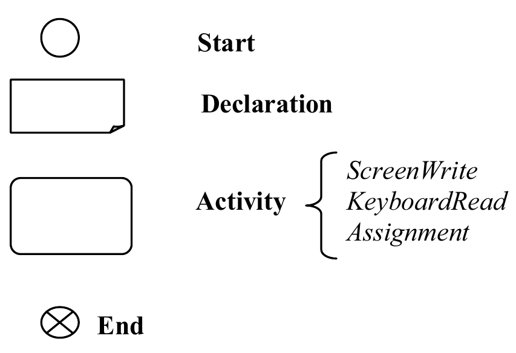

```{r setup, include=FALSE}
options(htmltools.dir.version = FALSE)
knitr::opts_chunk$set(
  fig.width=9, fig.height=3.5, fig.retina=3,
  out.width = "100%",
  cache = FALSE,
  echo = TRUE,
  message = FALSE, 
  warning = FALSE,
  hiline = TRUE
)
library(fontawesome)
library(xaringanthemer)
style_duo_accent(
  primary_color = "#1381B0",
  secondary_color = "#FF961C",
  inverse_header_color = "#FFFFFF",
  base_font_size = "25px"
)
library(xaringanExtra)
use_scribble()
use_fit_screen()
use_tile_view()
```

background-image: url("figs/greg-rosenke-WX4LFn24RxQ-unsplash.jpg")
background-size: cover

class: left, top, inverse

<p style="font-weight: 900; font-family: Georgia; font-size: 2.5rem; color: white; text-shadow: 2px 2px black;">
How not to panic
</p>

<p style="font-weight: 900; font-family: Georgia; font-size: 2rem; color: white; text-shadow: 2px 2px black;">
in face of an error message
</p>

<br>
<br>
<br>
<br>
<p style="font-weight: 900; font-family: Georgia; font-size: 1.8rem; color: white; text-shadow: 2px 2px black;">
Julia Romanowska
</p>

<p style="font-weight: 900; font-family: Georgia; font-size: 1rem; color: white; text-shadow: 2px 2px black;">
May 12, 2022
</p>


<p style="font-size: 12pt; font-weight: bold; right: 10px; bottom: 20px; position: absolute; ">
Photo by <a href="https://unsplash.com/@greg_rosenke?utm_source=unsplash&utm_medium=referral&utm_content=creditCopyText">Greg Rosenke</a> on <a href="https://unsplash.com/?utm_source=unsplash&utm_medium=referral&utm_content=creditCopyText">Unsplash</a>
</p>

???

Any programming requires understanding not only of how to use syntax of a
given programming language or script, but also how the instructions are
evaluated. Because when we know what's going on under the hood in each
step of the program, then we can easily search for sources of error _when_
it occurs. Note that I use "when", not "if" - because there will always be
errors, even if you're super experienced. That's why I don't want you to be
intimidated by the errors - treat them as a challenge.

---

class: inverse, right, middle

## Overview

### Computer basics

### Types of instructions

### How to translate a problem?

### Program execution

### Exercise

???

Today, I will provide you with a simple model of a computer in action. I will
briefly recap how a computer is made, then I will introduce the most important
types of instructions, next, I will show you how can we translate a simple
question into a program prototype and how an execution of such a program runs.

After this, I will give you a problem to solve.

---

### Computer basics

> _What is a computer?_

.pull-left[
**Physical machine**

- `r fa("microchip")` CPU

- `r fa("memory")` RAM

-  disk
]

???

CPU = central processing unit

RAM = random access memory

disk

These are all connected. CPU reads from and writes to memory, so to analyse
anything, we need to read it from a disk into the memory. Then, to save it for
later, we need to save it to disk.

--

.pull-right[
**Mental model**

- instructions

- processing:
  1. input
  2. store / analyse
  3. output
]

???

For now, however, let's forget the hardware and focus on a computer as a 
machine that processes data according to instructions.

In each of these three steps there can be an error!

---

### Types of instructions

**1. Declaration**

**2. Input**

**3. Output**

**4. Assignment**

???

Generally, all the instructions can be divided into these four most important
types: Declaration, Input, Output, and Assignment.

Various types can have various features - e.g., we cannot perform an addition
on two character variables.

---

### Types of instructions

**1. Declaration**

> **variable** = space allocated in RAM to hold some data

- **variable type**
  - character/string
  - numeric
  - date

- *example*    
`String name`

---

### Types of instructions

**2. Input**

- from keyboard or from file

- *example*    
`KeyboardRead name`

---

### Types of instructions

**3. Output**

- to a file or to the screen (*standard output*)

- *example*    
`ScreenWrite "Good morning, dear ", name`

---

### Types of instructions

**4. Assignment**

- *example*    
`var_name <- value`    
`var_name <- expression`


---

### How to translate a problem?

- Problem in natural language:    
*Compute sum of three numbers given by the user*

???

Usually, when we think about data processing, we have a good understanding
of the problem statement we want to solve. This is, however, formulated in 
words and abstractions that are completely not understandable for our machine.

We need to translate it to a code.

--

.pull-left[
Build a flowchart of the process!

*building blocks*


]

???

And for that, we need to split it into simple steps that can be then coded
with our instructions. We can build a flowchart using these building blocks.

--

.pull-right[


]

???

With this, it's much easier to write pseudo-code and then real code.

---

### Program execution

- _program state:_
  - variables in memory
  - values
  - next instruction

???

When we write down our program, it's static, but when we want the computer
to run it, it's becoming dynamic. Each code line changes something, so we need
to understand what's changing and where.

We need to think in terms of _program state_. Let's see how it works.

--

> **Example**

.pull-left[
**Program area**

```
[x] Numeric a, b, c
[ ] KeyboardRead a
[ ] KeyboardRead b
[ ] KeyboardRead c
[ ] Numeric total
[ ] total <- a + b + c
[ ] ScreenWrite "Sum is equal to ", total
```
]

.pull-right[
**Data area**

_(empty)_
]

---

### Program execution

- _program state:_
  - variables in memory
  - values
  - next instruction

> **Example**

.pull-left[
**Program area**

```
[ ] Numeric a, b, c
[x] KeyboardRead a
[ ] KeyboardRead b
[ ] KeyboardRead c
[ ] Numeric total
[ ] total <- a + b + c
[ ] ScreenWrite "Sum is equal to ", total
```
]

.pull-right[
**Data area**

 `a`  |  `b`  |  `c` |
:----:|:-----:|:----:|
 `NA` | `NA`  | `NA` |

]

---
### Program execution

- _program state:_
  - variables in memory
  - values
  - next instruction

> **Example**

.pull-left[
**Program area**

```
[ ] Numeric a, b, c
[ ] KeyboardRead a
[x] KeyboardRead b
[ ] KeyboardRead c
[ ] Numeric total
[ ] total <- a + b + c
[ ] ScreenWrite "Sum is equal to ", total
```
]

.pull-right[
**Data area**

 `a`  |  `b`  |  `c` |
:----:|:-----:|:----:|
 `19` | `NA`  | `NA` |

]

---
### Program execution

- _program state:_
  - variables in memory
  - values
  - next instruction

> **Example**

.pull-left[
**Program area**

```
[ ] Numeric a, b, c
[ ] KeyboardRead a
[ ] KeyboardRead b
[x] KeyboardRead c
[ ] Numeric total
[ ] total <- a + b + c
[ ] ScreenWrite "Sum is equal to ", total
```
]

.pull-right[
**Data area**

 `a`  |  `b`  |  `c` |
:----:|:-----:|:----:|
 `19` | `2`  | `NA` |

]

---
### Program execution

- _program state:_
  - variables in memory
  - values
  - next instruction

> **Example**

.pull-left[
**Program area**

```
[ ] Numeric a, b, c
[ ] KeyboardRead a
[ ] KeyboardRead b
[ ] KeyboardRead c
[x] Numeric total
[ ] total <- a + b + c
[ ] ScreenWrite "Sum is equal to ", total
```
]

.pull-right[
**Data area**

 `a`  |  `b`  |  `c` |
:----:|:-----:|:----:|
 `19` | `2`  | `126` |

]

---
### Program execution

- _program state:_
  - variables in memory
  - values
  - next instruction

> **Example**

.pull-left[
**Program area**

```
[ ] Numeric a, b, c
[ ] KeyboardRead a
[ ] KeyboardRead b
[ ] KeyboardRead c
[ ] Numeric total
[x] total <- a + b + c
[ ] ScreenWrite "Sum is equal to ", total
```
]

.pull-right[
**Data area**

 `a`  |  `b`  |  `c` | `total` |
:----:|:-----:|:----:|:-------:|
 `19` | `2`  | `126` |  `NA`   |

]

---
### Program execution

- _program state:_
  - variables in memory
  - values
  - next instruction

> **Example**

.pull-left[
**Program area**

```
[ ] Numeric a, b, c
[ ] KeyboardRead a
[ ] KeyboardRead b
[ ] KeyboardRead c
[ ] Numeric total
[ ] total <- a + b + c
[x] ScreenWrite "Sum is equal to ", total
```
]

.pull-right[
**Data area**

 `a`  |  `b`  |  `c` | `total` |
:----:|:-----:|:----:|:-------:|
 `19` | `2`  | `126` |  `147`  |

]

???

In each of these steps, there can be an error!

E.g., what will happen if we put a character instead of a number for one of
`a`, `b`, or `c`? It might be able to continue the program, but the number in
this position will be `NA`, so the sum of the values will also be `NA`.

---

class: middle, center

### Successful program

Requirements:

 _enough memory (RAM)_

 _all variables present_

 _permission to read from/write to disk_


---
class: inverse, right, middle

### Exercise 1

> Write a pseudocode that can be used to solve the following problem:

> _We received a CSV file with pollution values measured once per hour during_
> _last 24 hours. We need to compute mean pollution value. However, we know_
> _that these pollution values give highly skewed distribution, so first, we_
> _need to log-transform the data._

--

_To make it easier, new variable type: `NumericVec` might hold an entire_
_vector of values._

---
class: inverse, right, middle

### Exercise 2

> Write down all possible causes to the following error:

> _The calculated mean pollution value shows `NaN` (not a number) when printed to the screen._

