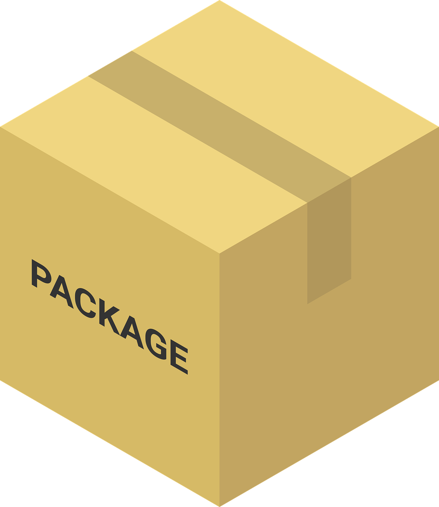
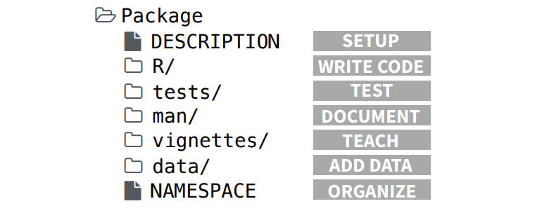
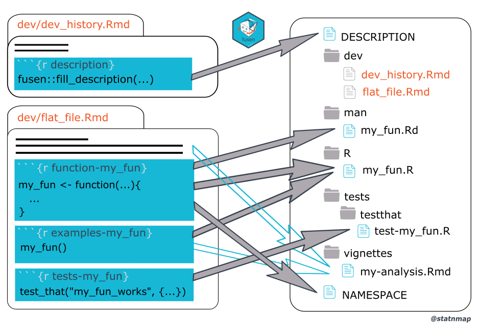
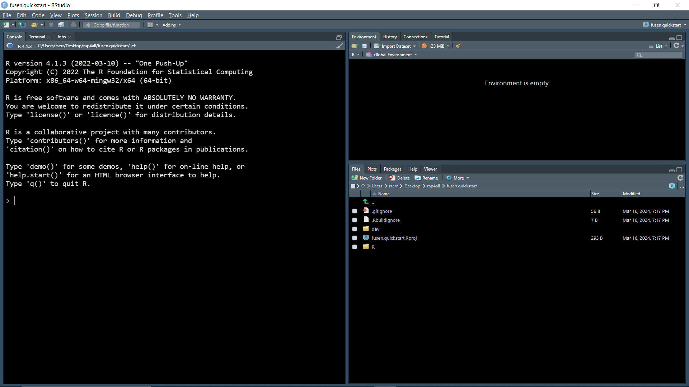
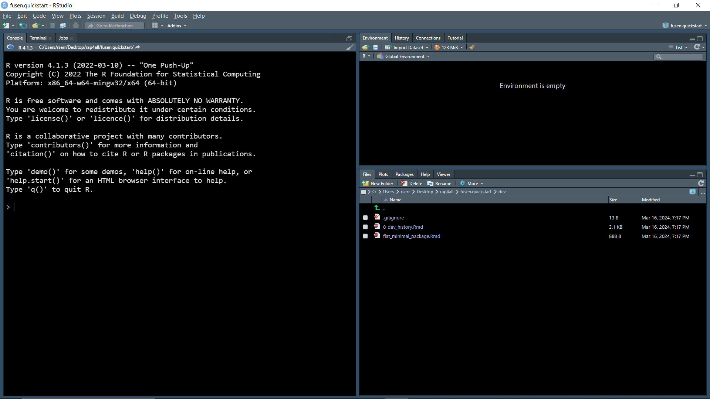
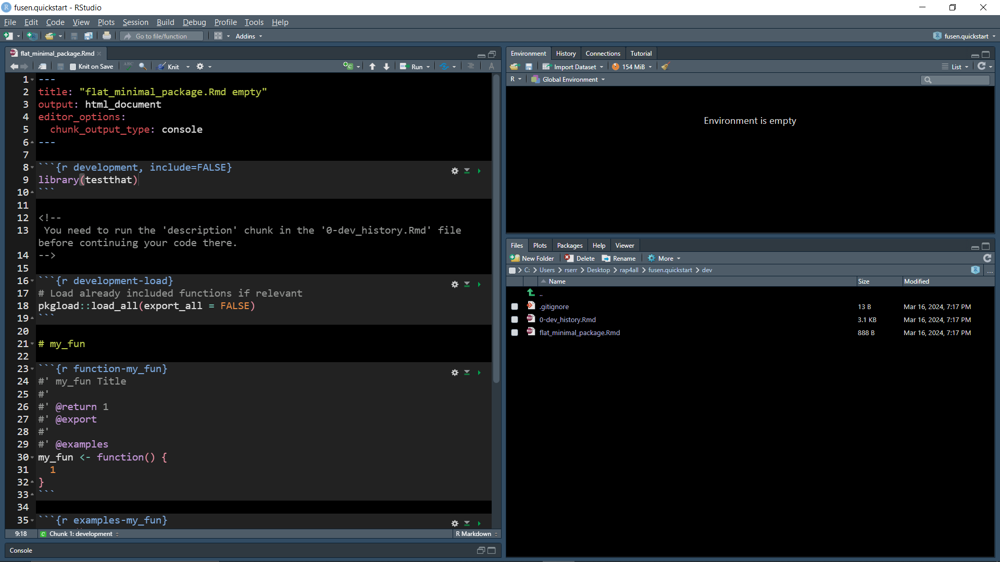
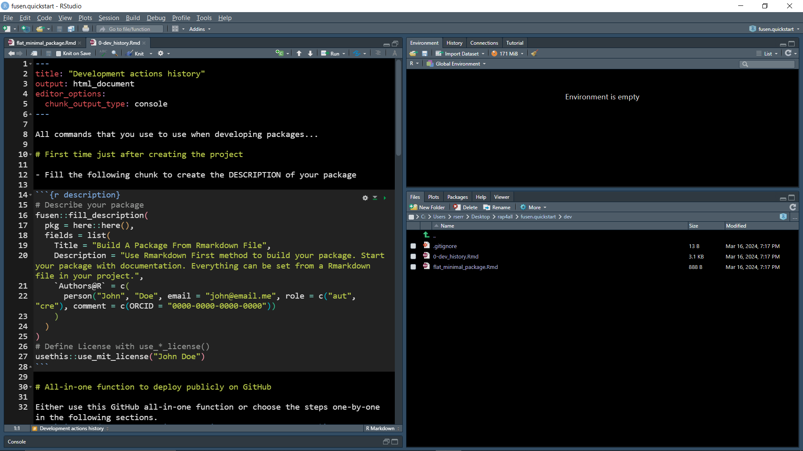
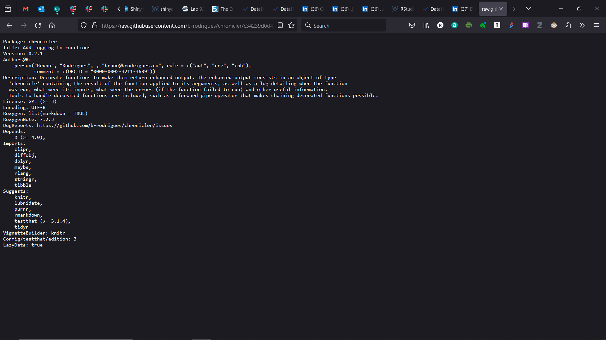
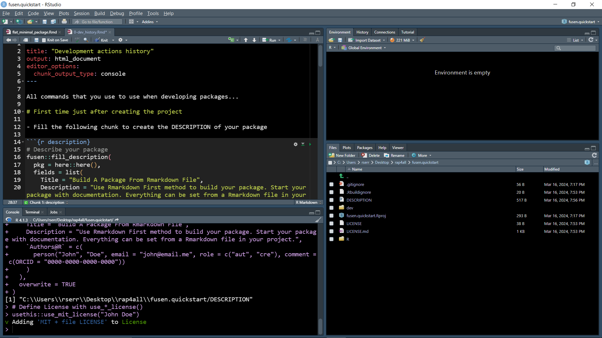
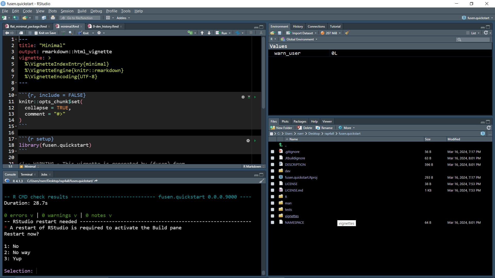

```{r setup, include=FALSE}
knitr::opts_chunk$set(echo = TRUE, warning = FALSE, message = FALSE, 
                      eval = FALSE, fig.width = 10, fig.height = 10)
```

# 

**About me**

- Industrial engineer/machinery and equipment appraiser
- Manufacturing (electronics/pharmaceuticals)
- 10 years - part-time faculty member in a local college
- Started a career change in 2019
- Co-organizer [Orlando Machine Learning and Data Science meetup](https://www.meetup.com/Orlando-MLDS/)
- [LinkedIn](https://www.linkedin.com/in/ricardojserrano/)

# 

**Learning objectives:**

- How to convert the analysis that we have done so far into a **package**.
- List benefits of developing a package.
- Introduce `{fusen}` package to accelerate the process of building your package.
- How to turn .Rmd files, including datasets, into a package.
- Installing and sharing the package.
- Conclusions

# 

- Have you created an R package?

# 

- Have you created an R package?

- Which R package(s) do you use frequently?

# **What is a package in R?**

- In R, the fundamental unit of shareable code is the **package**.
{height=640px width=480px}

- In simple terms, a package bundles together:
     * code
     * data
     * documentation
     * tests

- Makes it easier to share with other users.

# **Benefits of developing an R package**

- Reproducibility

- Makes it easier to reuse across projects

- Facilitates collaboration

# Introduction to `{fusen}`



# 



# **`{fusen}` process steps**

```{r load-fusen-script}
if (!require("fusen")){
     install.packages("fusen")
     library(fusen)
}
```

Start an R session from your home (or Documents) directory and run the following:
```{r create-fusen}
fusen::create_fusen(path = "fusen.quickstart",
                    template = "minimal")
```

The `create_fusen` function creates:

- a directory called `fusen.quickstart` in your Home directory
- creates a `fusen.quickstart.Rproj` file
- creates subfolders 'dev/' and 'R/

{height=800px width=1000px}

{height=800px width=1000px}

# 

{height=800px width=1000px}

# 

{height=800px width=1000px}

# 

Example of `DESCRIPTION` file

{height=800px width=1000px}

# 

Run code chunk named 'description' in an R console.

{height=800px width=1000px}

# 

Run 'development-inflate' code chunk.

{height=800px width=1000px}

