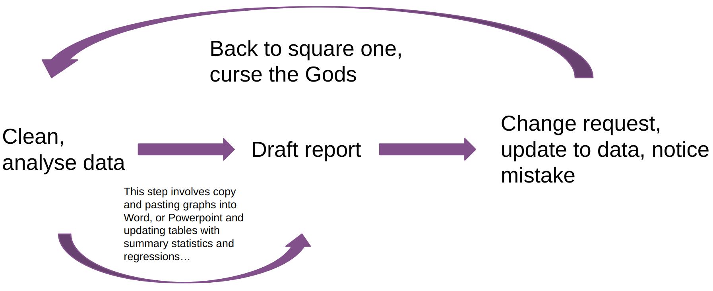
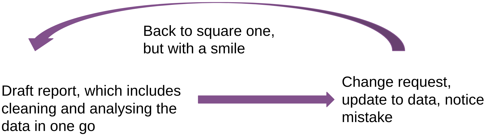
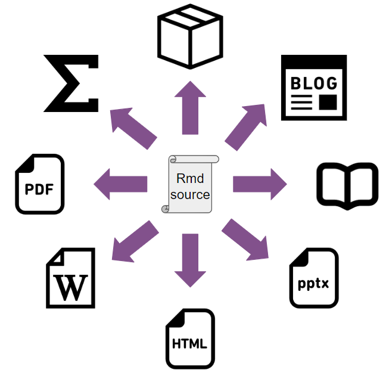

This hand-out was created for the Reproducible Pipelines Book Club organised by R-Ladies Bergen and R-ladies Cologne. It is based closely on Chapter 7 from "Building reproducible analytical pipelines with R" by Bruno Rodrigues available at: <https://raps-with-r.dev/> and quotes entire passages verbatim. The book is licensed under a Creative Commons Attribution-NonCommercial-ShareAlike 4.0 International License.

```{r setup, include=FALSE}
knitr::opts_chunk$set(echo = TRUE)

# Packages used in this document
requiredPackages <- c("datasauRus","flextable", "rmarkdown", "modelsummary", "tidyverse") # Note that {knitr} is included in rmarkdown

# Install packages not yet installed
for (package in requiredPackages) { #Installs packages if not yet installed
if (!requireNamespace(package, quietly = TRUE))
install.packages(package)
}

# Load packages
invisible(lapply(requiredPackages, library, character.only = TRUE))

```

## Motivation

The issues are illustrated here in the following cursed report drafting loop flowchart:



These same issues are wonderfully captured in this short video: <https://www.youtube.com/watch?v=s3JldKoA0zw>. In it, Git (which was the topic of a previous session, cf. Chapters 4 and 5 of the aforementioned book) and Rmarkdown are presented as possible solutions. Today we will focus on Rmarkdown. The aim is to arrive at the holy report drafting loop:



## The concept of literate programming

In literate programming, authors mix code and prose, which makes the output of their programs not just a series of tables, or graphs or predictions, but a complete report that contains the results of the analysis directly embedded into it. Scripts written using literate programming are also very easy to compile, or render, into a variety of document formats like `html`, `docx`, `pdf` or even `pptx`. R supports several frameworks for literate programming: Sweave, knitr and Quarto.

## R Markdown

### Formatting basics

The top section of the R Markdown document contains some metadata about the document. This section is called the YAML (which stands for "**Y**AML **A**in’t **M**arkup **L**anguage"!). When you knit the document, this information gets rendered into a nicely formatted header.

[Important]{.underline}: All other formatting options are also encoded as mark-up. In RStudio, you can toggle between the *Source* and *Visual* view to easily understand how that works.

It is possible to add links, footnotes, images and LaTeX formulas[^1], too.

[^1]: Note, however, that the latter will only be rendered in PDF and HTML documents

We can add "chunks" of code within the document. The chunk metadata begins with the programming language that the chunk is in and can optionally include a chunk name. Note that the `echo = FALSE` parameter was added to the code chunk to prevent printing of the R code that generated the plot.

```{r example chunk 1, echo=FALSE}

datasaurus_dozen |> 
  filter(dataset == "away") |> 
  ggplot(mapping = aes(x = x, y = y)) +
  geom_point()

```

### Supported languages

We always need to specify the engine in the chunk because {knitr} supports many engines. For example, it is possible to run some bash commands by adding this chunk to the source:

```{bash example chunk 2}
pwd
ls *.Rmd
```

Some of the available language engines include:

-   Python
-   SQL
-   Bash
-   Rcpp
-   Stan
-   JavaScript
-   CSS

You can list the names of all currently available engines via:

```{r knit engines}
names(knitr::knit_engines$get())
```

### Tables

The {flextable} package is a great tool for creating tables in R Markdown. There are lots of options and there is a whole, free e-book on it so I won't go into details: <https://raps-with-r.dev/lit_prog.html#fn12>. Here is just an example of how to use it and what the output looks like:

```{r flextable}
my_table <- head(datasaurus_dozen)

flextable(my_table) |>
  set_caption(caption = "First five rows of the datasaurus_dozen dataset") |>
  theme_booktabs()

```

We can also use the {modelsummary} package to print nice summary tables of models. Here are two entirely non-nonsensical linear models to demonstrate how to use it:

```{r modelsummary}

model_1 <- lm(x ~ y, data = datasaurus_dozen)
model_2 <- lm(x ~ y + dataset, data = datasaurus_dozen)

models <- list("Model 1" = model_1,
               "Model 2" = model_2)

modelsummary(models)
```

Finally, if you’re a researcher, take a look at the {rticles} package[^2], which provides Rmd templates to write articles for many scientific journals.

[^2]: <https://pkgs.rstudio.com/rticles/articles/examples.html>

### Supported outputs

You should know that {knitr} makes it possible to author many, many different types of documents. It is possible to write books, blogs, package documentation, Powerpoint slides… It is extremely powerful because we can use the same general R Markdown knowledge to build many different outputs. Rodrigues refers to this "One format to rule them all".



### Compiling PDF documents

If you want to compile PDF documents, you should also have a working LaTeX distribution. If you already have a working LaTeX installation, you shouldn't have to do anything else to generate PDF documents. If you don’t have a working LaTeX distribution, then Yihui Xie, the creator of {knitr} created an R package called {tinytex} which you can use to install a working LaTeX distribution very easily. The {tinytex} R package provides many functions that makes installing and maintaining it very easy). Simply run these commands in an R console to get started (but note that the installation process typically takes several minutes):

```{r tinytex install, eval=FALSE}

#install.packages("tinytex")
#tinytex::install_tinytex()

```

Note that I used the code chunk option `eval = FALSE` to ensure that the above chunk is not run when compiling the document. The command `knitr::opts_chunk$set` is used to set options that should apply by default to all chunks. It can usually be found in the very first chunk of a document.

To check if you can now knit to PDF, let's try to print this LaTeX formula in our document:

```{=tex}
\begin{align*}
S(\omega) 
&= \frac{\alpha g^2}{\omega^5} 
  e^{[ -0.74\bigl\{\frac{\omega U_\omega 19.5}{g}\bigr\}
   ^{\!-4}\,]} \\
&= \frac{\alpha g^2}{\omega^5} 
\exp\Bigl[ -0.74\Bigl\{\frac{\omega U_\omega 19.5}{g}\Bigr\}
  ^{\!-4}\,\Bigr] 
\end{align*}
```
## Don't repeat yourself (aka: "keeping it DRY")

Remember; we never, ever, want to have to repeat ourselves. Copy and pasting is forbidden. Striving for 0 copy and pasting will make our code much more robust and likely to be correct.

To keep DRY, we started by using functions, as discussed in the previous chapter, but we can go much further than that. For example, suppose that we need to write a document that has the following structure:

-   A title
-   A section
-   A table inside this section
-   Another section
-   Another table inside this section
-   Yet another section
-   Yet another table inside this section

We'll now look at the following files to understand how i) templates can be used and ii) child documents to avoid repeating ourselves:

i.  rmd_templating.Rmd

ii. rmd_child_doc_dino.Rmd

## Parametrized reports

Check out this chapter from Zachary M. Smith's R Markdown Crash Course to learn about parametrized reports: <https://zsmith27.github.io/rmarkdown_crash-course/lesson-7-parameterized-reports.html>

## A note on Quarto

Finally, the latest in literate programming for R is a new tool developed by Posit, called Quarto. If you’re an R user and already know {knitr} and the Rmd format, you should be able to immediately use Quarto. So what’s the difference? In practice and for R users not much but there are some things that Quarto is able to do out of the box for which you’d need extensions with {knitr}. Quarto has some nice defaults; in fact, this book is written in Quarto’s Markdown flavour and compiled with Quarto instead of {knitr} because the default Quarto output looks nicer than the default {knitr} output. However, there may even be things that Quarto can’t do at all (at least for now) when compared to {knitr}. So why bother switching? Well, Quarto provides sane defaults and some nice features out of the box, and the cost of switching from the Rmd format to Quarto’s Qmd format is basically 0. Also, and this is probably the biggest reason to use Quarto, Quarto is not tied to R. Quarto is actually a standalone tool that needs to be installed alongside your R installation, and works completely independently. In fact, you can use Quarto without having R installed at all, as Quarto, just like {knitr} supports many engines. This means that if you’re primarily using Python, you can use Quarto to author documents that mix Python chunks and prose. Quarto also supports the Julia programming language and Observable JS, making it possible to include interactive visualisations into an Html document.

While Quarto is the latest option in literate programming, it is quite recent, and as such, I feel it might be better to stick with {knitr} and the Rmd format for now, so that’s what we’re going to use going forward. Also, the {knitr} and the Rmd format are here to stay, so there’s little risk in keeping using it, and anyways, as already stated, if switching to Quarto becomes a necessity, the cost of switching would be very, very low. In what follows, I won’t be focused on anything really {knitr} or Rmd specific, so should you want to use Quarto instead, you should be able to follow along without any problems at all, since the Rmd and Qmd formats have so much overlap. Also, Quarto needs to be installed separately, but to use {knitr} and RMarkdown, no specific tools are necessary.
